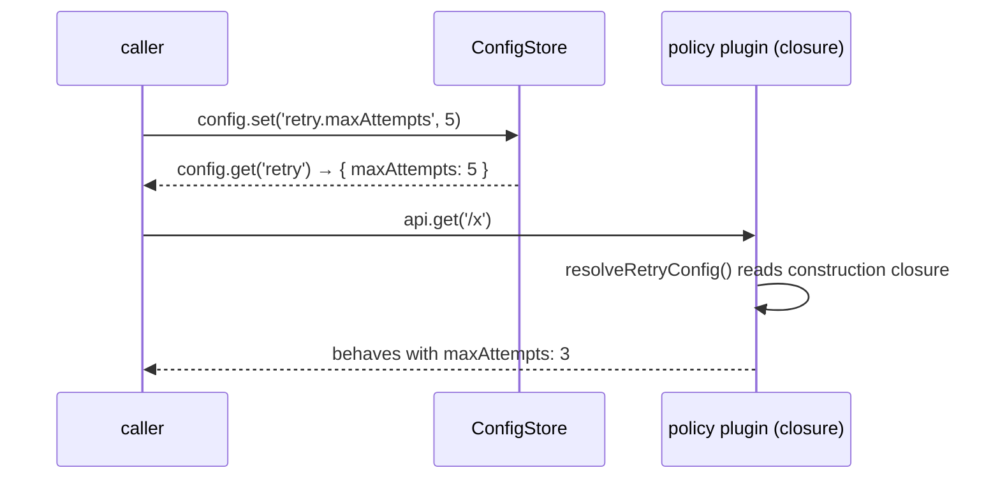

# Fetch policy config coherence

## Problem

A review of FetchEngine's policy logic (issue #145 follow-up work, 2026-07-11) surfaced five coherence defects where configuration is accepted but silently diverges from behavior:

- **F1** — `engine.config.set('retry.maxAttempts', 5)` is a documented, typed API (`options/index.ts:33-36` docblock), but all five policy plugins (`retry`, `dedupe`, `cache`, `rate-limit`, `cookies`) capture their config in closures at construction. Runtime `set()` changes what `config.get()` returns — and what response metadata reports — but never changes behavior.
- **F2** — `retry: false` (engine or per-call) silently disables `attemptTimeout`: the zero-attempts pass-through branch (`plugins/retry.ts:56-68`) never wires the per-attempt controller/timer. Probe-confirmed: `attemptTimeout: 60` ran 510ms and resolved; control with `maxAttempts: 1` rejected at 62ms with `timedOut: true`.
- **F3** — engine convenience methods (`clearCache`, `clearCacheKey`, `deleteCache`, `invalidateCache`, `invalidatePath`, `cacheStats`) silently no-op when `cachePlugin`/`dedupePlugin` are installed via the `plugins:` array — the `#cachePlugin`/`#dedupePlugin` refs are captured only on the config-key path (`engine/index.ts:261,269`).
- **F4** — `res.config.retry` on every response reports the engine-level retry config (`executor.ts:702,731` use `this.retryConfig`), ignoring a per-call `retry` override. Metadata says 3 attempts while the request ran with 0.
- **F5** — a falsy explicit config key (`dedupePolicy: false`, `cookies: false`, `retry: false`) plus the same-name plugin in the `plugins:` array throws at construction, because the conflict check treats any `!== undefined` key as claiming the policy. A spread-in base config with `dedupePolicy: false` plus an explicit plugin gets a construction error for a configuration whose intent is unambiguous.

Common shape: config surfaces accept input and report success while behavior follows a different source of truth. Fixing them makes one invariant hold everywhere: **what config reports is what behavior does.**

The F1 divergence flow:

## Goals / Non-goals

- Goals:
  - Runtime `config.set()` of a policy key changes that policy's behavior (F1).
  - `attemptTimeout` fires whether or not retrying is enabled (F2).
  - Cache/dedupe convenience methods work regardless of how the plugin was installed (F3).
  - `res.config.retry` reports the retry config the request actually ran with (F4).
  - Falsy config key + same-name plugin: warn and install the plugin; truthy key + same-name plugin stays a construction-time throw (F5).
- Non-goals:
  - No per-call `skipDedupe` / `skipRateLimit` options (rejected earlier: no credible single-request story; config callbacks cover it).
  - No extraction of the attempt-timeout machinery out of the retry plugin (bigger refactor; the plugin remains the attempt executor).
  - No runtime mutation surface for custom (non-policy) plugins.
  - No changes to `@logosdx/utils`.

## Approaches

F1 is the only finding with competing approaches; F2-F5 each have one obvious shape recorded in the Recommendation.

| # | Approach | Pros | Cons |
|---|----------|------|------|
| A | Plugins read live config per-request (`config.get()` inside each hook) | Always current; no event wiring | Touches all five plugins' internals; per-request read cost; policy state (buckets, rules cache) must detect config drift anyway to rebuild; standalone factory usage (explicit config, no engine key) needs a second code path |
| B | Reinstall on change: engine listens for config changes, runs the plugin's cleanup, rebuilds from the new value, reinstalls | Generic — zero plugin-internal changes; works for all five uniformly | Wipes plugin state on every change: cache store lost, in-flight dedupe joins dropped, rate-limit buckets reset — surprising blast radius for a `maxAttempts` tweak |
| C | Document policy keys as construction-only; `set()` on them throws | Smallest change; honest | Contradicts the decision to fix; removes a documented capability |
| D | `reconfigure` hook: optional `FetchPlugin.reconfigure(config)`; engine subscribes to its own config-change event and calls it on the config-key-built plugin; policies implement it via their existing `init()` | State-preserving where sensible (policies already own `init()` + rules-cache reset); retry is a small closure change; uniform contract; custom plugins unaffected | Adds one optional member to the plugin interface; each policy needs a thin `reconfigure` wire-up |

## Recommendation

**F1 → Approach D.** The three `ResiliencePolicy` subclasses already expose `init(config)` that rebuilds rules caches and state (`plugins/rate-limit.ts:129-174` and siblings) — `reconfigure` is a thin wrapper over machinery that exists. Retry holds no state, so its `reconfigure` just replaces the resolved base config. The engine subscribes once to its own config-change event (`ConfigStore.set` already emits it, `options/index.ts:87`) and routes changed policy keys to the matching installed plugin. Two rules make the edges coherent:

- A runtime `set()` of a policy key whose plugin came from the user's `plugins:` array throws — the same ownership rule as construction (config key and user plugin cannot both own a policy).
- Policy state on reconfigure follows each policy's `init()` semantics: rate-limit buckets and rules caches rebuild (new budgets → fresh buckets), and the cache plugin's store survives — it lives in the request-flight layer (`SingleFlight`, constructed once with its adapter) alongside the policy, so TTLs, rules, and methods reconfigure in place without touching stored entries.
- The cache **adapter** is construction-only: the flight layer binds its adapter at construction and exposes no swap, so a runtime `set()` that changes `cachePolicy.adapter` throws with a message saying the adapter requires a new engine. Silently rebuilding the flight layer would drop every cached entry — the exact silent divergence this design eliminates.

**F2** — the zero-retries path must run through the same per-attempt wiring as the loop path. `maxAttempts: 0` is behaviorally identical to `maxAttempts: 1` with retrying disabled; the fix normalizes the pass-through into the single-attempt path so the attempt controller/timer always exist. Evidence: the loop path already does everything needed (`plugins/retry.ts:91-141`); only the early branch bypasses it.

**F3** — `#resolvePlugins` captures `#cachePlugin`/`#dedupePlugin` refs by `plugin.name` from whichever source supplied the plugin (config-built or user array); `use()` at runtime captures the same way. The convenience methods then work identically for both installation paths.

**F4** — the executor attaches the per-request resolved retry config to `res.config` instead of the engine-level value, using the same resolution the retry plugin applies (per-call wins in both directions). Single source of resolution — metadata equals behavior by construction, not by parallel logic.

**F5** — the conflict check distinguishes truthy from falsy explicit keys: truthy key + same-name plugin throws (two live configs, ambiguous owner); falsy key + same-name plugin warns once at construction (`console.warn`, naming the key and plugin) and installs the plugin — the falsy key configured nothing, so the plugin is the unambiguous owner; the warn surfaces the contradiction for the reader who spread a shared base config.

## Open questions

- None. All five dispositions were decided by the maintainer on 2026-07-11; the F1 approach choice is delegated to this design and resolved above.
