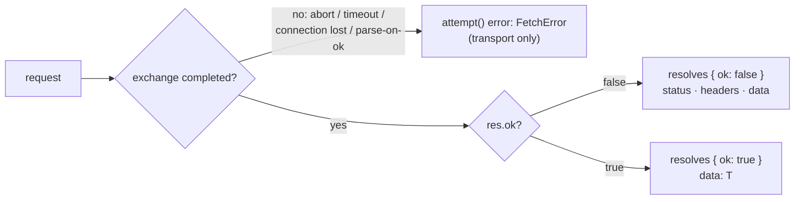

# Design: fetch resolve-on-response error model


## Problem


`FetchEngine` throws a `FetchError` for every non-2xx response (`executor.ts:715-724`). A 400/500 is a *completed* HTTP exchange — the server received, processed, and answered — yet the engine destroys the response and rebuilds a lossy projection of it onto an error object:

- Response headers are lost. `FetchError.headers` carries **request** headers; the documented `error.headers['retry-after']` retry pattern reads `undefined`, always.
- The body is smuggled as untyped `err.data`.
- The sanctioned usage pattern (`attempt()` tuples) immediately catches the throw and converts it back into a value — the library's own errors-as-values philosophy, round-tripped through exception machinery for nothing.
- Five unrelated situations (cancel, timeout, connection lost, non-2xx answer, unparsable body) exit through one channel and must be disentangled by the caller.
- `afterRequest` hooks never see non-2xx: Set-Cookie on 401/403 is silently dropped (RFC 6265 violation), and the cache/cookie plugins are blind to half of reality.
- Internal precedent already exists: `.raw()` and `.stream()` resolve on non-2xx today (no ok-check on that path, `executor.ts:682-688`).

Outcome channels, new model:




## Goals / Non-goals


Goals:

- Non-2xx responses resolve as `FetchResponse` with full `status` / `headers` / `data`.
- `FetchError` narrows to transport-only: abort, timeout, connection lost, parse failure on `ok: true`, client-side rate-limit reject.
- `FetchResponse` becomes a discriminated union on `ok` so TypeScript forces the negative-path check.
- Event taxonomy recalibrated: `response` universal, `error` transport-only, new `response-4xx` / `response-5xx` diagnostics channels.
- Retry decisions receive the response when one exists.

Non-goals:

- No `throwHttpErrors` / `validateStatus` escape hatch — clean break, major version.
- No caching of `ok: false` responses (HTTP-cacheable 404s may be a later opt-in).
- No change to `.raw()` / `.stream()` semantics (already resolve-on-response).
- No change to rate-limit plugin behavior (client-side reject stays an error — no response exists).
- No redirect (3xx) or informational (1xx) dedicated events — `response` covers them.


## Approaches


| # | Approach | Pros | Cons |
|---|----------|------|------|
| A | Status quo + attach response headers to `FetchError` | Smallest diff; fixes the `retry-after` symptom | Keeps the category error; error object keeps growing into a shadow response |
| B | Configurable throw (`validateStatus`, axios-style) | Per-instance choice | Two contracts to test/document forever; default still wrong |
| C | Resolve-on-response, discriminated union on `ok` | Honest channels; aligns with `attempt()` philosophy and platform `fetch()`; compiler-enforced negative path; fixes cookie/cache blindness | Major breaking change; wide type/test/docs ripple |
| D | C + `throwHttpErrors: true` escape hatch (got-style) | Softer migration | Doubles permanent test/doc surface for a transitional need |


## Recommendation


**C — clean break.** The library's identity is errors-as-values; the engine should practice it. Decisions locked with the user (2026-07-08):

| # | Decision |
|---|----------|
| 1 | `shouldRetry` receives `FetchResponse \| FetchError` — response for HTTP-status retries, error for transport retries. `retryableStatusCodes` stays as the zero-config default. |
| 2 | Parse failure on an `ok: false` body falls back to raw text in `data` — the body format never masks the status. Parse failure on `ok: true` remains an error (contract broken). |
| 3 | Clean break. No escape hatch. Major version via changesets. |
| 4 | New events `response-4xx` / `response-5xx`; `response` becomes universal; `error` narrows; per-attempt emission (mirrors today's per-attempt `error`). |


## DX comparison


Today — five situations, one tangled channel; the response is destroyed on non-2xx:

    ```ts
    const [res, err] = await attempt(() => api.get<User>('/users/123'));

    if (err) {

        if (isFetchError(err)) {

            if (err.isCancelled())      return;
            if (err.isTimeout())        return retryLater();
            if (err.isConnectionLost()) return goOffline();

            if (err.status === 400) return showValidation(err.data); // untyped, smuggled
            if (err.status >= 500)  return alertOps(err.requestId);  // err.headers = REQUEST headers
            if (err.step === 'parse') return badPayload();
        }
        return;
    }

    res.data;    // only 2xx reaches here
    ```

New — three honest channels:

    ```ts
    const [res, err] = await attempt(() => api.get<User>('/users/123'));

    if (err) {
        // transport only — no response exists
        if (err.isCancelled())      return;
        if (err.isTimeout())        return retryLater();
        if (err.isConnectionLost()) return goOffline();
        return badPayload(err);    // parse contract broken on a 2xx
    }

    if (!res.ok) {
        // exchange succeeded; the answer was "no" — full response available
        res.headers['retry-after'];    // present
        if (res.status === 400) return showValidation(res.data);
        if (res.status >= 500)  return alertOps(res.headers['x-request-id']);
        return;
    }

    res.data;    // narrowed to User by the ok check
    ```

New `shouldRetry` shape:

    ```ts
    shouldRetry(outcome: FetchResponse<unknown> | FetchError, attempt: number): boolean | number {

        if (isFetchError(outcome)) return outcome.isConnectionLost();

        if (outcome.status === 429) {
            const after = outcome.headers['retry-after'];
            return after ? Number(after) * 1000 : 5000;
        }

        return outcome.status >= 500;
    }
    ```


## Event taxonomy


| Event | Today | New |
|-------|-------|-----|
| `response` | 2xx only (emit sits after the ok-throw) | all responses, any status |
| `error` | non-2xx + transport + parse | transport + parse-on-ok + rate-limit reject |
| `abort` | cancellations/timeouts | unchanged |
| `response-4xx` | — | new: client-error diagnostics |
| `response-5xx` | — | new: server-error diagnostics |
| `retry` | carries `error` | carries `error \| response` |
| `before-request`, `after-request` | per attempt (`executor.ts:567`, `:605`) | unchanged, per attempt |

Event trees per scenario (`before-request`/`after-request`/`error` all fire per attempt today — grounded at `executor.ts:567,605,536`):

    ```
    200 success (identical both versions)      400 Bad Request
    ├─ before-request                          TODAY                 NEW
    ├─ after-request                           ├─ before-request     ├─ before-request
    └─ response                                ├─ after-request      ├─ after-request
                                               └─ error              ├─ response
                                                                     └─ response-4xx
                                                                     ⇒ resolves { ok: false }

    500 with retry (maxAttempts 3)             Dropped connection (both versions)
    TODAY (per attempt)   NEW (per attempt)    attempt N
    ├─ before-request     ├─ before-request    ├─ before-request
    ├─ after-request      ├─ after-request     │  ✖ fetch rejects — no after-request
    ├─ error              ├─ response          ├─ error (step 'fetch')
    ├─ retry              ├─ response-5xx      ├─ retry (carries FetchError)
    ...                   ├─ retry (response)  └─ error — THROWS in both versions
    └─ error → THROWS     ...
                          └─ response + response-5xx
                          ⇒ resolves { ok: false, status: 500 }

    Parse failure on 200 (both: error, step    Parse failure on 500 + .json():
    'parse' — contract broken)                 TODAY: error (masks the 500)
                                               NEW: response + response-5xx,
                                                    data = raw text
    ```


## Blast radius


| Area | Coupling | Work |
|------|----------|------|
| executor (`engine/executor.ts`) | ok-throw at `:715-724`; `#handleError` step-response branch `:479-508`; `err.data` smuggling | delete throw + branch; emit new events; build `ok` discriminant |
| retry plugin (`plugins/retry.ts:128-158`) | total — throw-driven loop | second trigger on `result.ok === false` + `retryableStatusCodes`; union `shouldRetry`; `retry` event payload; default config in `helpers/validations.ts` |
| cache plugin (`plugins/cache.ts`) | protected by the throw today | `ok: false` guard in afterRequest store (`:461-489`) AND in SWR revalidation (`:540-576` — a resolving 500 would otherwise overwrite good stale data: silent-corruption risk) |
| dedupe plugin | none semantically | joiners share `ok: false` responses; no change required |
| rate-limit plugin | none — pre-response phase | untouched; `RateLimitError` stays an error |
| cookies plugin | starved by the throw | gains Set-Cookie capture on non-2xx for free (latent bug fix); needs pinning test |
| `FetchResponse` (`types.ts`) | — | discriminated union `{ ok: true, data: T } \| { ok: false, data: unknown }`; ripples through `FetchPromise` + all method signatures |
| `FetchError` (`helpers/fetch-error.ts`) | — | drop `data` + `T` generic; `step` narrows to `'fetch' \| 'parse'`; 499 helpers stay |
| events (`engine/events.ts`) | — | EventMap additions; `retry` payload union |
| react package | real design work | see below |
| tests | 33 fetch files (~17.5k lines; 7 assert throw-on-status) + 6 react files | rewrite error-path assertions; add pinning tests |
| docs | 9 surfaces | `skills/logosdx/references/fetch.md`, `docs/packages/fetch/{resilience,configuration,events}.md`, `docs/wiki/fetch.md`, `docs/what-is-logosdx.md`, `docs/packages/react.md` (llm copies regenerate) |


## Invariants


- A `FetchError` exists **iff** no usable response exists. Every completed exchange resolves.
- The body format never masks the status (`ok: false` parse falls back to text).
- `ok: false` is never cached — neither in the afterRequest store nor via SWR revalidation.
- Set-Cookie is captured regardless of status.
- Diagnostics events fire per attempt; `requestId` ties attempts together.
- Only the parsed paths change; `.raw()` / `.stream()` keep their existing resolve semantics.


## React hooks error-state shape


Today `useQuery` / `useMutation` / `useFetch` expose `error: FetchError | null` and consumers read `error.status`. With the engine resolving non-2xx, the hooks must choose:

| # | Shape | Pros | Cons |
|---|-------|------|------|
| R1 | Conflate: `error` fed by both transport errors and `ok: false` responses | Zero-surprise for UI code ("did it fail?" = one check) | Re-conflates the channels the engine just separated; awkward union type |
| R2 | Discriminate: `error` transport-only; expose `response`, consumer checks `!response.ok` | Mirrors engine contract | Every UI must check two fields; silent breakage for existing "render on error" code |
| R3 | Discriminated failure union: `failure: { kind: 'transport', error } \| { kind: 'http', response } \| null` | One failure check for UI **and** channels stay distinguishable; honest type | Field rename (fine in a major) |

**Recommendation: R3.** UI code overwhelmingly wants one "it failed" state — the hook layer is the right altitude to re-merge, but the union keeps the distinction available (`failure.kind === 'http' && failure.response.status === 404`). Pending user veto.


## Open questions


- React hooks failure shape — R3 recommended, awaiting user confirmation (veto window: design review).
