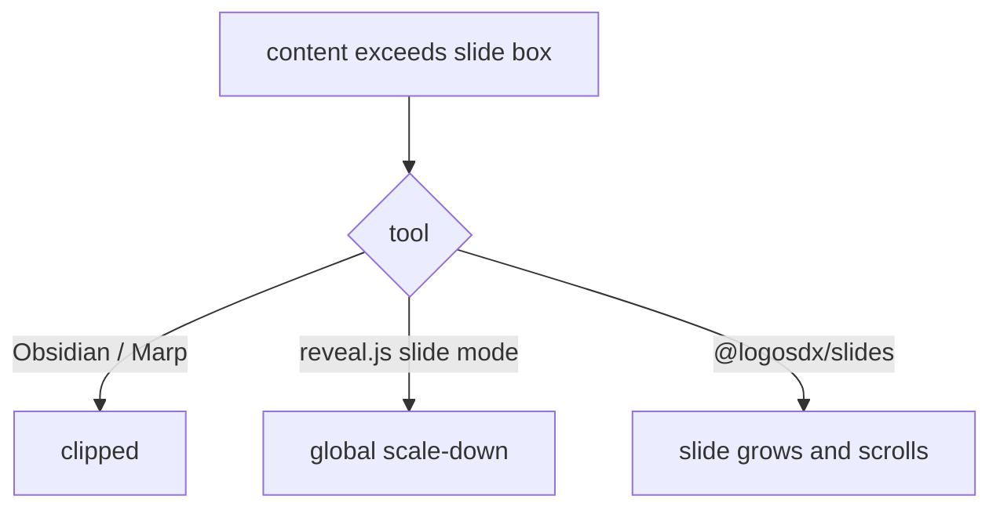
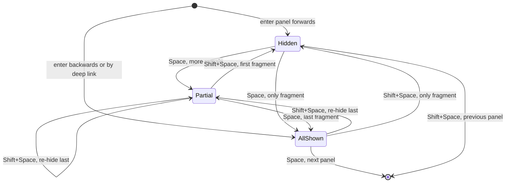

# Design: `@logosdx/slides`, HTML-native presentation primitives


## Problem


Presentation tools force authors to choose between expressive and navigable.

- **Slide tools** (PowerPoint, Google Slides, Keynote) are navigable, but a slide is a fixed canvas, not a document.
- **Markdown slide tools** (Obsidian Slides, Marp, Slidev) are authorable but clip. Content that exceeds the slide box is cut off with no scroll and no overflow affordance. The author's only recourse is to shrink the font or split the slide.
- **reveal.js** owns slide positioning through CSS transforms, so scrolling inside a slide fights the transform, and its overflow answer in slide mode is a global scale-down. Its 5.0 scroll view flattens the deck into one linear page, which fixes reading on a phone but gives up the two-axis structure and still sizes each slide to the viewport by default.

HTML and CSS already express far more than any slide format: real typography, tables, `<details>`, grid, SVG, video, live iframes, highlighted code. What is missing is the navigation and framing layer around them.

LLM authoring adds a second problem. An agent asked to "make a presentation" invents the whole machine each time: keyboard handlers, slide state, transitions, an overflow strategy. That is a large surface to get subtly wrong. The agent should write content (HTML and CSS inside a slide) and leave the slide engine to a library.

What happens when slide content exceeds the slide box, per tool:




## Goals / Non-goals


Goals:

- **Overflow scrolls, never clips.** A slide taller than the viewport is a scrollable region. Without this the library has no reason to exist.
- **Two-axis navigation.** Horizontal slides are the top-level narrative; vertical slides are depth within a point.
- **Authoring surface is plain HTML.** The slide is a normal block container. Anything valid inside a `<div>` is valid inside a `<slide>`.
- **Zero install, zero build.** One `<link>` and one `<script>` from a CDN. No npm, no bundler, no framework.
- **Useful without JavaScript.** The stylesheet alone produces a readable, scrollable, printable document. JS adds navigation, not legibility.
- **Small enough to memorize.** An agent holds the entire API in working memory: four elements, a handful of attributes.

Non-goals:

- No Prezi-style zoom/camera choreography in v1 (see *v1 scope*).
- No Markdown parsing. Content is HTML; converting Markdown is the caller's job.
- No theming framework. One neutral default stylesheet plus documented CSS custom properties.
- No authoring GUI, no server, no runtime dependency beyond the `@logosdx` packages.
- No slide-content sandboxing. Author markup is trusted, as in a hand-written page.


## Verified browser behavior


Four assumptions in this design were tested in Playwright against Chromium 145 and WebKit 26 (2026-10-05), with decks loaded from `file://`. The decisions below cite these results.

| # | Assumption | Chromium | WebKit | Consequence |
|---|---|---|---|---|
| 1 | `y mandatory` traps the reader at the edges of a tall slide | False. Rests at any point inside a tall panel (wheel, arrow keys, `scrollTo`) | False. Same | Decision 2 keeps `mandatory` |
| 2 | `y mandatory` and `y proximity` differ somewhere | Yes. A rest straddling two panels snaps under `mandatory`, stays put under `proximity` | Yes. Same, but snaps to a different edge than Chromium | Decision 2 |
| 3 | `<slide>` nests cleanly, like a `<div>` | False. An unclosed `<p>` or `<li>` makes the parser ignore the next `</slide>`, so every later slide nests inside that paragraph | False. Same | Decision 1, parser recovery |
| 4 | `customElements.define('slides')` throws | True, `SyntaxError` (also for `slide`, `notes`) | True | Decision 1 |
| 5 | The deck can write the notes popup's DOM directly on `file://` | True | True | Speaker notes |
| 6 | The popup survives its own reload | False. Reloads to an empty `about:blank` that is now cross-origin to the deck | False. Reloads empty, but stays writable | Speaker notes, recovery |
| 7 | `BroadcastChannel` works between two `file://` tabs | Delivers | Silently drops the message | Speaker notes |

Not tested: touch flings on a real phone, Firefox, and any headed-browser difference. The mobile snapping behavior in Decision 2 is hand-checked on a device through the demo before release.


## Decision 1: unregistered elements, not custom elements


The authoring surface is `<slides>`, `<slide horizontal>`, `<slide vertical>`. It cannot use the Custom Elements registry: `customElements.define()` requires a valid custom element name, which contains a `-`, so `customElements.define('slides', …)` throws `SyntaxError` (result 4).

The names still work as unknown elements. `<slides>` parses into an `HTMLUnknownElement`, which extends `HTMLElement`: it is stylable, queryable, and scriptable. It loses the lifecycle callbacks (`connectedCallback`, `attributeChangedCallback`) and the `:defined` pseudo-class.

`@logosdx/dom`'s `observe()` replaces the lifecycle. It wraps `MutationObserver`, runs a handler for matching elements present and future, and returns a cleanup, which covers `connectedCallback` and `disconnectedCallback`.

| # | Approach | Pros | Cons |
|---|----------|------|------|
| A | `<lx-slides>` / `<lx-slide>` custom elements | Real lifecycle callbacks; `:defined` for FOUC; namespaced against future spec collisions | Not the requested surface; more to type in every slide; prefix is noise in agent-authored HTML. Same parser hazard as B |
| B | **`<slides>` / `<slide>` unregistered, upgraded via `observe()`** | The requested surface; minimal markup; dogfoods `observe()` | No native lifecycle; parser hazard below; small forward-compat risk if HTML standardizes these names |
| C | `<div is="slide">` customized built-ins | Spec-sanctioned lifecycle; `</div>` closes an open `<p>` | Safari has never shipped `is=`; verbose |

**Chosen: B.** The stylesheet alone lays out the deck correctly, so there is no unstyled flash for `:defined` to hide. If HTML ever defines `<slide>`, the upgrade path is an alias, not a rewrite.

### Parser hazard: unclosed `<p>` and `<li>`

The HTML parser closes an open `<p>` when it meets `</div>`, but not when it meets the end tag of an unknown element. With a `<p>` still open, `</slide>` is ignored, the slide stays open, and every following slide parses as its child (result 3). Option A's custom elements behave the same, because the rule depends on the element being unknown to the parser, not on registration.

What the author wrote, and what the parser built:

```html
<!-- written -->
<slides>
    <slide><p>one</slide>
    <slide>two</slide>
    <slide>three</slide>
</slides>

<!-- parsed: one column -->
<slides>
    <slide><p>one<slide>two</slide><slide>three</slide></p></slide>
</slides>
```

Leaving `<p>` and `<li>` unclosed is valid HTML that humans and agents write, so the upgrade step repairs it rather than only warning (the same reasoning as Decision 4):

A `<slide>` whose parent is neither `<slides>` nor `<slide>` is misplaced.

| # | Case | Result |
|---|---|---|
| 1 | Misplaced, explicit `horizontal` | Moves, with its following siblings, to after its column, as a column. |
| 2 | Misplaced, explicit `vertical` | Moves, with its following siblings up to the next explicit `horizontal` slide, into its column as a panel, after the column child that contains it. |
| 3 | Misplaced, no axis attribute | Moves, with its following siblings up to the next explicit `horizontal` slide, to after its nearest `<slide>` ancestor, as that ancestor's sibling. |
| 4 | `<slide>` directly inside a panel | Moves to become the next sibling panel after its parent panel; several in one panel keep their order. |

Each repair logs one `console.warn` naming the slide that triggered it, so the author can close the tag; carried siblings are not warned again. The full case list lives in `docs/spec/slides.md`. Explicit axis attributes make cases 1 and 2 exact; without them, case 3 is the best inference available. The docs tell authors to close `<p>` and `<li>` inside slides.


## Decision 2: `mandatory` snapping on both axes


The deck snaps horizontally between columns and vertically between panels. The headline feature depends on the vertical axis letting a reader stop anywhere inside a panel taller than the viewport.

An earlier draft chose `scroll-snap-type: y proximity`, on the belief that `mandatory` pulls a reader out of the middle of a tall panel. The spec and both engines say otherwise. CSS Scroll Snap Level 1 states that when a snap area is larger than the snapport, "any scroll position in which the snap area covers the snapport ... is a valid snap position". Chromium and WebKit both rest anywhere inside a tall panel under `mandatory`, through wheel, arrow keys, and `scrollTo` (result 1).

The two modes differ only where the viewport straddles two panels (result 2):

| Viewport position | `y mandatory` | `y proximity` |
|---|---|---|
| Inside a tall panel | rests | rests |
| Straddling the end of one panel and the start of the next | snaps to a panel edge | rests half and half |
| Near the start of a short panel | snaps | snaps |

**Chosen: `mandatory` on both axes.** A presenter never wants the projector to show the bottom half of one slide and the top half of the next, and `mandatory` rules that out without cost to tall panels. The engines disagree on which edge wins from a straddle (Chromium pulls back to the tall panel's end, WebKit forward to the next panel's start). Both are acceptable, and keyboard navigation does not depend on either, because "next slide" is an explicit `scrollIntoView()`.

`scroll-snap-stop: always` stays on both axes so a fast swipe stops at each slide. The experiments used wheel and keyboard input and showed no difference with or without it; its effect on touch flings is the open device check from *Verified browser behavior*.


## Decision 3: one document, one deck


**A document contains exactly one `<slides>`, and it owns the viewport.** Embedded, inline, and multi-deck pages are out of scope.

The deck is a singleton, so no arbitration is needed over which deck receives arrow keys or owns the URL hash, and there is no focus model to design. `Deck` is a module-level singleton. A second `<slides>` is a console error, and extras are ignored.

Height is `100dvh`, not `100vh`. On mobile Safari, `vh` measures the viewport without the collapsible URL bar, so a `100vh` deck is taller than the visible screen and every slide sits cropped.


## Decision 4: loose column content is wrapped, not warned about


A column may hold both loose content and `<slide vertical>` children:

```html
<slide horizontal>
    <h2>Chapter 2</h2>          <!-- loose: not inside any panel -->
    <slide vertical>Point A</slide>
    <slide vertical>Point B</slide>
</slide>
```

The `<h2>` is not a snap target. Untouched, it renders above Point A and is visible only at the top of the column's scroll. Three readings of that markup are defensible:

| Option | Result | Cost |
|---|---|---|
| **(a) Auto-wrap** | 3 slides: title, Point A, Point B | One DOM mutation of author markup |
| (b) Warn only | A stranded half-slide, plus a console message | Punishes the most likely markup with a subtly broken deck |
| (c) Column chrome | 2 slides, with "Chapter 2" pinned across both | A real feature, and a real design commitment |

**Chosen: (a).** Loose content other than `<notes>` preceding the first panel is wrapped into an implicit leading `<slide vertical data-implicit>` during upgrade. Option (b) punishes the markup that agents and humans most often write, and it fails quietly. Option (c) is a real idiom, but it should be requested, not received by accident. It can arrive later behind its own attribute without invalidating (a), since wrapping only touches content the author did not place in a panel.

An explicit `<slide vertical>` always wins, so an author who dislikes the inference writes the wrapper.


## Decision 5: fragments ship in v1, minimally


Fragments are step-reveal: content appearing one piece at a time.

```html
<slide horizontal>
    <h2>Why the launch slipped</h2>
    <ul>
        <li fragment>QA found the auth bug late</li>
        <li fragment>The vendor API changed under us</li>
        <li fragment>Nobody told support</li>
    </ul>
</slide>
```

Without fragments, the same effect needs four near-identical slides, each with one more bullet. That is the deck inflation this library exists to remove, and step-reveal is the most-used presentation feature after "next slide".

The cost sits in one place: advance stops being a jump and becomes a state machine.



The fragment index joins the URL and the speaker-notes view.

**Excluded from v1:** custom ordering via `data-fragment-index`, and reveal styles (fade-out, highlight, grow). Most of reveal.js's fragment complexity lives there.

Fragments must not be hidden by unconditional CSS. A script that fails to load (offline, blocked CDN, a typo in the tag) would then hide authored content permanently. Hiding is gated on the JS-set `data-ready` flag, so no JS means every fragment is visible and the deck degrades to a complete document.


## Structure and semantics


```html
<slides>

    <slide horizontal>
        <h1>Title</h1>
    </slide>

    <slide horizontal>
        <slide vertical>
            <h2>The claim</h2>
        </slide>
        <slide vertical>
            <h2>The evidence</h2>
            <p>…arbitrarily long content, which scrolls…</p>
        </slide>
    </slide>

</slides>
```

- `<slides>` is the deck: one horizontal scroll container.
- `<slide horizontal>` is a **column**: a direct child of `<slides>`, one viewport wide, and itself a vertical scroll container.
- `<slide vertical>` is a **panel**: a child of a column, `min-height: 100%`, free to grow taller.

**Attributes are optional.** Axis is inferred from position: a `<slide>` directly inside `<slides>` defaults to `horizontal`; a `<slide>` inside another slide defaults to `vertical`. The upgrade step writes the resolved attribute back onto the element, so the inferred and explicit forms are identical afterward. Agent-authored markup stays correct when the attribute is forgotten, and the attribute is available as a styling hook either way. Explicit attributes also make the parser repair in Decision 1 exact. When an explicit attribute contradicts the slide's position, position wins: upgrade rewrites the attribute and logs `console.warn`.

**A column with no vertical children is itself the panel.** The common single-panel case needs no nesting.

**Upgrade mutates author markup in four cases only:** repairing slides the parser misplaced (Decision 1), moving a `<slide>` nested inside a panel out to become the next panel, rewriting an axis attribute that contradicts position, and wrapping loose column content (Decision 4). All are deterministic, run once, and leave a trace (`console.warn`, `data-implicit`).


## CSS contract


The stylesheet carries the layout; without it nothing scrolls. Abbreviated:

```css
slides {
    display: flex;
    overflow-x: auto;
    overflow-y: hidden;
    scroll-snap-type: x mandatory;
    scroll-behavior: smooth;
    height: 100dvh;              /* dvh, not vh: mobile URL bars */
    overscroll-behavior: contain;
}

slides > slide {                 /* column */
    flex: 0 0 100%;
    height: 100%;
    scroll-snap-align: start;
    scroll-snap-stop: always;
    overflow-y: auto;
    scroll-snap-type: y mandatory;   /* see Decision 2 */
    overscroll-behavior: contain;
}

slide[vertical] {
    min-height: 100%;            /* min-height, not height: lets the panel grow */
    scroll-snap-align: start;
    scroll-snap-stop: always;
}

notes { display: none; }        /* unconditional: never reaches the shared screen */

slides[data-ready] [fragment]:not([revealed]) {
    visibility: hidden;         /* gated on data-ready: see Decision 5 */
}

@media print { /* linearize: no snap, no fixed heights, page-break per slide */ }
@media (prefers-reduced-motion: reduce) { slides { scroll-behavior: auto } }
```

`min-height: 100%` on the panel plus `overflow-y: auto` on the column is the fix for the clipping problem. The rest is framing.

Unrevealed fragments use `visibility: hidden` rather than `display: none` so they keep their layout box. Revealing a bullet then does not reflow the ones already on screen.

The public theming surface is CSS custom properties on `slides` (`--slide-padding`, `--slide-bg`, `--slide-fg`, `--deck-font`, …). Authors override with ordinary CSS.


## JavaScript responsibilities


JS never positions anything; the browser's scroll engine does. JS coordinates, built on `@logosdx` primitives:

| Concern | Implementation | Primitive |
|---|---|---|
| Upgrade / normalize | scan + observe for `slides`; assign axis; repair misplaced slides; wrap loose content | `dom` `observe()` |
| Active tracking | `IntersectionObserver` maintains `[active]`, no scroll listeners | `dom` `watchVisibility()` |
| Navigation | `next` / `prev` / `nextColumn` / `prevColumn` / `goTo(idOrIndex)`, all via `scrollIntoView` | `dom` `$` |
| Input binding | arrows, space, PgUp/PgDn, Home/End, Esc | `dom` `on()` + `AbortSignal` |
| Events | `slide:enter`, `slide:leave`, `deck:ready`, `fragment:show` | `observer` `ObserverEngine` |
| URL sync | `#/<column>/<panel>` or `#<slide-id>`, back/forward correct | `utils` |
| Fragments | `[fragment]` step-reveal; advance exhausts fragments before moving | `dom`, `observer` |
| Speaker notes | popup window driven by direct DOM writes | `observer` events |

Auto-init runs on DOM ready when a `<slides>` element exists; the `Deck` class is exported for manual control. Every entry point returns a cleanup, per house convention.

Extensions (presenter timer, remote control, progress bar) subscribe to the `ObserverEngine` events. A `HookEngine` plugin surface waits until a second feature needs to intercept deck behavior rather than observe it; notes alone do not justify one.


## Keyboard control


If `↓` always jumped to the next panel, a long slide's content would be reachable by mouse and touch but not by keyboard. Vertical keys therefore scroll first and advance only at the panel's edge.

| Key | Action |
|---|---|
| `→` / `←` | Next / previous **column**, regardless of scroll position. |
| `↓` / `↑` | Scroll within the panel if there is room; **advance to the next/previous panel only at the edge**. |
| `Space` / `Shift`+`Space` | Universal advance/retreat: fragments, then panel, then column. The one key a presenter needs. |
| `PageDown` / `PageUp` | Panel-level jump; ignores fragments and scroll position. |
| `Home` / `End` | First / last slide. |
| `S` | Open, or reopen, the speaker-notes window. |
| `F` | Fullscreen. |
| `.` / `B` | Blank the screen without leaving the deck. |
| `?` | Key help overlay. |

Two guards apply. Input is ignored when the event target is an `input`, `textarea`, `select`, or `contenteditable`, because decks contain live demos and hijacking arrows there breaks them. And `S` / `F` must come from a real keypress: `window.open()` and `requestFullscreen()` both require transient user activation, so neither can run on load.

Bindings attach via `dom`'s `on()` with an `AbortSignal`, so teardown is a single `abort()`.

### Releasing a move that stopped short

A key move tracks its target panel so panels crossed on the way never fire `slide:enter`. When something interrupts the move (a focus scroll, find-in-page, an author `scrollTo`, a scrollbar drag), the deck must let go of the target or `active` freezes.

The deck releases a pending move when the deck's `scrollLeft` and the target column's `scrollTop` hold still for 10 animation frames while the target is off center. Measured smooth scrolls in Chromium 145 and WebKit 26 hold still for at most 3 frames at start-up and 1 frame mid-flight, including reversals.

| Approach | Why not |
|---|---|
| `scrollend` with filters | `scrollend` is per scroller and does not say which scroll ended. A late event from the previous move released the next one (about 4 in 100 fast ←→ presses); the filter that fixed it ignored a focus scroll that returned every scroller to its start, and an early column event discarded mid-move was never re-checked. |
| Activate only after scrolling settles | Delays every `slide:enter`, user scrolling included, and still needs the pending target so a second key press steps from where the deck is going. |


## Speaker notes


Notes are authored as a `<notes>` element inside any slide and hidden by an unconditional `notes { display: none }`. The hiding is pure CSS, so notes cannot appear on the projected screen during load or after a script failure.

```html
<slide horizontal>
    <h2>Q3 revenue</h2>
    <notes>Pause here. The 40% figure is the one they'll push back on.</notes>
</slide>
```

Pressing `S` opens a popup with `window.open('', 'lx-notes', 'popup,width=…')`, and the deck writes the notes view into that blank document. No second HTML file is hosted, which keeps the zero-install promise. The view shows the current notes, a next-slide preview cloned with `importNode`, and elapsed and wall-clock time.

A separate window, rather than an overlay, lets the presenter share only the deck window while the notes stay on their own display.

### Transport: direct DOM writes

Agent-generated decks are single HTML files that users double-click, so they run on `file://`. The design has to work there first.

The blank popup inherits the deck's origin, so the deck updates the notes view by writing to `pop.document` through the window reference it keeps (result 5). There is no message protocol: on each `slide:enter`, the deck writes the notes, preview, and indices into the popup.

Two transports were rejected:

| Transport | Why not |
|---|---|
| `postMessage` between deck and popup | Adds a protocol for a window the deck can already write to. The popup holds no code of its own, so nothing in it could answer after a reload |
| `BroadcastChannel` | WebKit drops messages between `file://` tabs (result 7). It also reaches only same-origin tabs in the same browser, never a second device, and a manually opened tab would have no notes view to open |

### Recovery

Reloading the popup leaves an empty `about:blank` (result 6). In Chromium that page is cross-origin to the deck, so the old reference cannot write to it. Closing the popup has a similar effect.

The deck detects both cases before each write: `pop.closed`, or an access to `pop.document` that throws or finds the view missing. It then marks the notes window disconnected and stops writing. Pressing `S` again closes the stale window and opens a fresh one, which works in both engines because `S` is a keypress with user activation. The key help overlay says so.

A second-device view (phone as remote, tablet as notes) needs a hosted page and a real channel; it is deferred.


## Distribution


`browserNamespace: "LogosDx.Slides"` puts an IIFE bundle at `dist/browser/bundle.js`, published to npm and served by jsDelivr/unpkg, the same path every other package in this repo takes.

```html
<link rel="stylesheet" href="https://cdn.jsdelivr.net/npm/@logosdx/slides/dist/browser/slides.css">
<script src="https://cdn.jsdelivr.net/npm/@logosdx/slides/dist/browser/bundle.js"></script>
```

**This requires a build-script change.** `scripts/build.mjs` copies `src` into `dist/cjs` and `dist/esm`, so a `src/slides.css` reaches those outputs, but nothing copies it into `dist/browser/`, and the Vite IIFE lib build would emit an imported stylesheet as a separate uninjected asset. The build needs an explicit CSS copy step into `PATHS.BROWSER`. The IIFE also needs its own entry, so `scripts/vite.config.ts` uses `src/browser.ts` when a package has one. These two scripts are the only changes outside the new package.


## Why this shape suits agent authoring


- **Four elements and two axis attributes** are the entire structural vocabulary; they fit in a prompt.
- **Attribute inference and parser repair mean the loose form works**, so the most likely generation mistakes do not break the deck.
- **Overflow is not the author's problem.** The agent writes as much content as the point needs without estimating whether it fits, which is the judgment LLMs are worst at.
- **No install step** removes the failure where a presentation cannot be viewed because dependencies were not fetched.
- **Content is ordinary HTML/CSS**, the format agents write best, rather than a bespoke slide DSL.


## Element and attribute reference


| Element | Placement | Meaning |
|---|---|---|
| `<slides>` | one per document | The deck. Owns the viewport. |
| `<slide horizontal>` | child of `<slides>` | A column. Axis inferred if omitted. |
| `<slide vertical>` | child of a column | A panel. Grows and scrolls. Axis inferred if omitted. |
| `<notes>` | inside any slide | Speaker notes. Never rendered in the deck. |

| Attribute | On | Set by | Meaning |
|---|---|---|---|
| `horizontal` / `vertical` | `slide` | author or upgrade | Axis. Inferred from nesting depth when absent. |
| `fragment` | any element in a slide | author | Step-revealed on advance. |
| `revealed` | `[fragment]` | JS | Fragment is currently shown. |
| `active` | `slide` | JS | Slide is the current one. |
| `data-ready` | `slides` | JS | Deck initialized. Gates fragment hiding. |
| `data-implicit` | `slide` | upgrade | Panel was synthesized from loose content. |


## v1 scope


In: two-axis scroll-snap navigation, overflow-scrolling slides, parser repair, keyboard control, speaker notes in a popup window, fragments, URL sync, print/PDF linearization, the `ObserverEngine` event surface, CDN + npm distribution.

Deferred:

- Prezi-style zoom/camera layer over the scroll substrate. The transform engine was rejected outright so that this can be added later on top of scrolling.
- Presenter timer and remote-control view, as `ObserverEngine` subscribers.
- A `HookEngine` plugin surface, when a second feature needs to intercept deck behavior.
- Second-device notes, which need a hosted page and a channel that works off `file://`.
- Persistent column chrome (Decision 4, option c), behind an explicit attribute.
- Transitions beyond scroll. The scroll-snap substrate constrains these, and that is a deliberate v1 trade.
- Markdown-to-slides adapter.
- Fragment ordering (`data-fragment-index`) and reveal styles.


## Open questions


- Touch flings on iOS Safari and Android Chrome: does `scroll-snap-stop: always` with `y mandatory` stop at each panel, and does a fling out of a tall panel overshoot? Hand-checked on a device through the demo before release.


## Implementation notes


Build order that keeps each step verifiable:

1. **`src/slides.css` alone.** Hand-write a deck HTML file and confirm two-axis snapping, long-slide scrolling, and the print layout with no JS loaded. Every later step depends on this one.
2. **Build-script CSS copy** into `PATHS.BROWSER` (see *Distribution*), one of the two changes outside the new package.
3. **Upgrade + normalize** via `observe()`: axis inference, parser repair, implicit-panel wrapping, `data-ready`.
4. **Active tracking** via `watchVisibility()`, then the `ObserverEngine` event surface.
5. **Navigation + keyboard**, including the scroll-before-advance edge check.
6. **Fragments**, which extend the advance/retreat state machine from step 5.
7. **URL sync**, once column/panel/fragment indices all exist.
8. **Speaker notes**, including the disconnect and reopen path.

Testing: the suite is Vitest with a jsdom project and a Playwright/Chromium project. Scroll snapping, `IntersectionObserver`, and `window.open` do not work under jsdom, so navigation, active tracking, and notes belong in `tests/src/smoke/` against real Chromium. Upgrade, normalization, parser repair, and the fragment state machine are DOM transforms that unit-test in jsdom; parser repair tests must feed raw HTML through the parser (`innerHTML` or `DOMParser`), not build the tree by hand, because the hazard only exists in parsed markup. The experiments behind *Verified browser behavior* become smoke tests: tall-panel rest under `mandatory`, straddle snapping, and notes reopen after a popup reload. Per house rules, tests import from `../../../../packages/slides/src/index.ts`.
