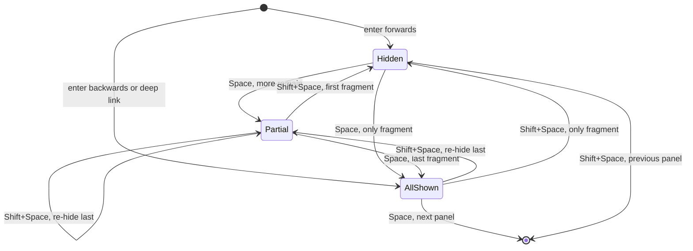

# Slides


`@logosdx/slides` turns `<slides>`, `<slide>`, and `<notes>` markup into a keyboard-driven deck. Columns run sideways, panels stack down each column, and a panel taller than the screen scrolls instead of being scaled down or cut off. Reach for it when a talk is written as HTML: one stylesheet lays the deck out, one script adds keys, fragments, URL sync, and speaker notes.

```html
<link rel="stylesheet" href="https://cdn.jsdelivr.net/npm/@logosdx/slides@latest/dist/browser/slides.css">
<script src="https://cdn.jsdelivr.net/npm/@logosdx/slides@latest/dist/browser/bundle.js"></script>

<slides>
    <slide>
        <h1>Quarterly review</h1>
    </slide>
    <slide>
        <slide><h2>Revenue</h2></slide>
        <slide><h2>Churn</h2><notes>Mention the March outage.</notes></slide>
    </slide>
</slides>
```

That page is a working deck: `→` moves to the second column, `↓` to the churn panel, `S` opens the speaker notes.

[[toc]]

## Installation


### CDN

Link the stylesheet and load the browser bundle. The bundle builds the deck on DOM ready for the first `<slides>` in the page and exposes `Deck` as `LogosDx.Slides.Deck`.

```html
<link rel="stylesheet" href="https://cdn.jsdelivr.net/npm/@logosdx/slides@latest/dist/browser/slides.css">
<script src="https://cdn.jsdelivr.net/npm/@logosdx/slides@latest/dist/browser/bundle.js"></script>
```

### npm

::: code-group

```bash [npm]
npm install @logosdx/slides
```

```bash [yarn]
yarn add @logosdx/slides
```

```bash [pnpm]
pnpm add @logosdx/slides
```

:::

The package does not export the stylesheet. Link it from `node_modules`, or copy it into your static assets:

```html
<link rel="stylesheet" href="/node_modules/@logosdx/slides/dist/browser/slides.css">
```

```bash
cp node_modules/@logosdx/slides/dist/browser/slides.css public/slides.css
```

Importing the package has no side effects, so construct the deck yourself:

```typescript
import { Deck } from '@logosdx/slides';

const deck = new Deck();
```

## Quick Start


```html
<!doctype html>
<html lang="en">
<head>
    <meta charset="utf-8">
    <meta name="viewport" content="width=device-width, initial-scale=1">
    <link rel="stylesheet" href="https://cdn.jsdelivr.net/npm/@logosdx/slides@latest/dist/browser/slides.css">
    <script src="https://cdn.jsdelivr.net/npm/@logosdx/slides@latest/dist/browser/bundle.js"></script>
</head>
<body>
<slides>
    <slide horizontal>
        <h1>Loan pipeline</h1>
        <p>Q3 status for the underwriting team</p>
    </slide>
    <slide horizontal>
        <slide vertical>
            <h2>Approvals</h2>
            <ul>
                <li fragment>Volume up 12%</li>
                <li fragment>Median time to decision: 4 days</li>
            </ul>
        </slide>
        <slide vertical id="risks">
            <h2>Risks</h2>
            <p>Two lenders paused jumbo loans.</p>
            <notes>Name both lenders; they agreed to be named.</notes>
        </slide>
    </slide>
</slides>
</body>
</html>
```

Open the file in a browser. Press `?` for the key list. The axis attributes are optional: the deck infers them from position and writes them back.

## Elements and Attributes


A deck is a row of columns. A column either holds vertical panels or is a panel itself.

```
slides                      the deck, one per document
├── slide horizontal        column with no vertical children: it is the panel
└── slide horizontal        column
    ├── slide vertical      panel
    │   └── notes           speaker notes for this panel
    └── slide vertical      panel
```

| Element | Placement | Meaning |
|---|---|---|
| `<slides>` | One per document | The deck. Owns the viewport. |
| `<slide horizontal>` | Child of `<slides>` | A column. A column with no vertical children is itself the panel. |
| `<slide vertical>` | Child of a column | A panel. At least the viewport's height; grows and scrolls. |
| `<notes>` | Inside any slide | Speaker notes. Never rendered in the deck. |

| Attribute | On | Set by | Meaning |
|---|---|---|---|
| `horizontal` / `vertical` | `slide` | Author or the deck | Axis. |
| `fragment` | Any element in a slide | Author | Revealed one step at a time. |
| `revealed` | `[fragment]` | The deck | The fragment is shown. |
| `active` | Panel | The deck | The panel being presented. |
| `data-ready` | `slides` | The deck | The deck is running. Fragments hide only while it is set. |
| `data-implicit` | `slide` | The deck | A panel the deck made from loose content. |
| `manual` | `slides` | Author | The browser bundle does not build the deck. |

A `<notes>` placed directly in a column belongs to the panel before it. Notes before a column's first panel belong to that first panel:

```html
<slide horizontal>
    <slide vertical><h2>Approvals</h2></slide>
    <notes>These notes belong to the Approvals panel.</notes>
    <slide vertical><h2>Risks</h2></slide>
</slide>
```

Content other than `<notes>` in a column before its first panel is wrapped into a `<slide vertical data-implicit>`, so navigation can reach it. Content between or after panels stays where it is.

## Keyboard


| Key | Action |
|---|---|
| `→` / `←` | Next / previous column, landing on its first panel. |
| `↓` / `↑` | Scroll the column while the panel extends past the screen in that direction; at the panel's edge, move to the next / previous panel in the column. |
| `Space` / `Shift+Space` | Next / previous step: fragments first, then panels in reading order, crossing columns. |
| `PageDown` / `PageUp` | Next / previous panel in reading order, crossing columns, ignoring fragments and scroll position. |
| `Home` / `End` | First panel of the first column / last panel of the last column. |
| `S` | Open the speaker notes, or reopen them after closing or reloading the notes window. |
| `F` | Toggle fullscreen for the whole page. |
| `.` / `B` | Toggle a blank screen. |
| `?` | Toggle the key help overlay. |
| `Esc` | Close the help overlay, or unblank. |

Reading order runs down each column, then on to the next column.

The deck ignores keys while Ctrl, Meta, or Alt is held, so browser shortcuts keep working. It also ignores keys aimed at an `input`, `textarea`, `select`, `button`, `summary`, `audio[controls]`, `video[controls]`, or `contenteditable` element, so a live demo inside a slide keeps its keys.

Mouse wheel, touch, and scrollbar scrolling work as on any scrolling page. The panel at the center of the deck becomes `active`.

## Fragments


Mark any element inside a panel with `fragment`. `Space` reveals them one at a time, in document order. The deck sets `revealed` on each shown fragment, so style the reveal with that attribute. Gate the rules on screen media and `slides[data-ready]`, as the stylesheet does, so both print and a deck whose script fails to load show every fragment:

```css
@media screen {

    slides[data-ready] [fragment] {
        transition: opacity 200ms, visibility 200ms;
    }

    slides[data-ready] [fragment]:not([revealed]) {
        opacity: 0;
    }
}
```

Stepping back into a panel lands on its finished state, and `Shift+Space` re-hides one fragment at a time:



Entering a panel forwards hides all its fragments, and entering it backwards shows all of them. The direction rule applies to keys, `next()`, `prev()`, `nextColumn()`, `prevColumn()`, and mouse or touch scrolling. `PageDown`, `PageUp`, `→`, and `←` skip fragment steps.

Without the script, or before it runs, every fragment is visible. Fragments hide only under `slides[data-ready]`.

## URL


The deck writes its position into the URL hash, and reads it back on load and on every `hashchange`.

| Hash | Lands on |
|---|---|
| `#/<column>/<panel>` | That position, 0-based, with all fragments shown. |
| `#/<column>/<panel>/<fragment>` | That position with `<fragment>` fragments shown. |
| `#<id>` | The panel containing the element with that id, with all fragments shown. |

The deck always writes the positional form, adding the fragment segment when the panel has fragments. Moving to another panel adds a history entry, so browser back returns to the previous panel. A fragment step replaces the current entry.

An in-slide link to an element id moves the deck to the panel holding that element:

```html
<a href="#risks">Skip to risks</a>
```

| Hash | Result |
|---|---|
| No hash on load | First panel, fragments hidden. |
| Malformed or out-of-range positional hash | `console.warn`; the deck stays where it is. |
| `#<id>` that matches nothing, or a bare `#` | The deck stays where it is, silently. |

## Speaker Notes


Press `S` to open a popup window named `lx-notes`. The deck writes into it directly:

- the active panel's notes, with their markup
- the column, panel, and fragment position
- the elapsed time since the notes first opened, and the wall-clock time
- a preview of the next panel, with video, audio, and iframes replaced by placeholders so nothing plays or loads

The view updates on every panel change and every fragment step. Drag the popup to the presenter screen and present the deck on the projector.

The popup runs no code of its own, so reloading it leaves it blank. The deck notices and stops writing to it. Press `S` again: the deck closes the stale window and opens a fresh one. The elapsed time keeps counting across reopens.

When the browser blocks the popup, the deck logs `console.warn` and keeps running. Allow popups for the page, then press `S` again.

## Deck API and Events


The browser bundle builds the deck itself and gives you no handle to it. To subscribe to events, add `manual` to `<slides>` and construct the deck yourself:

```html
<slides manual>
    <!-- slides -->
</slides>

<script>
    const { Deck } = LogosDx.Slides;

    const deck = new Deck();
    const progress = document.querySelector('#progress');

    deck.on('slide:enter', ({ column, panel }) => {

        progress.textContent = `${column + 1}.${panel + 1}`;
    });
</script>
```

With the npm package there is no auto-init, so `manual` is not needed:

```typescript
import { Deck } from '@logosdx/slides';

const deck = new Deck();

const stopTracking = deck.on('slide:enter', ({ slide, column, panel }) => {

    analytics.track('slide_viewed', { id: slide.id, column, panel });
});

deck.on('fragment:show', ({ fragment, index }) => {

    console.log('revealed step', index, fragment);
});

// Stop delivery for one listener
stopTracking();

// Tear down before swapping the deck's content for another talk
deck.destroy();
```

### Methods

| Member | Behavior |
|---|---|
| `new Deck(root?)` | `root` is the `<slides>` element; defaults to the first in the document. Repairs the markup, sets `data-ready`, binds keys, and applies the URL hash. |
| `deck.next()` | Same as `Space`. No-op at the end. |
| `deck.prev()` | Same as `Shift+Space`. No-op at the start. |
| `deck.nextColumn()` / `deck.prevColumn()` | Same as `→` / `←`. |
| `deck.goTo(target)` | Moves to an element id, or to `{ column, panel, fragment? }` (0-based; `fragment` is the revealed count, omitted shows all). |
| `deck.on(event, listener)` | Subscribes. Returns a cleanup that stops delivery. |
| `deck.destroy()` | Removes event listeners, key bindings, observers, overlays, `active`, and `data-ready`, closes the notes popup, and allows a new `Deck`. Repaired markup stays. |

An id passed to `goTo` resolves to the panel containing that element. An element in a column but outside every panel resolves to the panel before it, or to the column's first panel.

### Events

| Event | Payload | Fires |
|---|---|---|
| `deck:ready` | `{ slide }` | Once, asynchronously, with the first active panel. Subscribe right after construction to receive it. A deck destroyed before it fires emits none. |
| `slide:leave` | `{ slide, column, panel }` | Before `slide:enter`, on each change of active panel. |
| `slide:enter` | `{ slide, column, panel }` | After each change of active panel. |
| `fragment:show` | `{ slide, fragment, index }` | Per fragment revealed by a step: `Space`, `next()`, or `goTo` with a `fragment` count on the active panel. A step on the target of a move still under way fires at once, before that panel's `slide:enter`. `index` is the fragment's 0-based position in the panel. |
| `fragment:hide` | `{ slide, fragment, index }` | Per fragment re-hidden by a step. |

Entering a panel sets its fragments without fragment events. A deck constructed with no slides fires `deck:ready` when its first panel appears.

### Errors

| Call | Throws when |
|---|---|
| `new Deck()` | Another `Deck` is live, the document has no `<slides>`, or `root` is not a `<slides>` element. |
| `deck.goTo(id)` | No element in the deck has that id. |
| `deck.goTo(position)` | The column, panel, or fragment count is out of range (`RangeError`). |

`goTo` with a user-supplied target is the one call worth guarding:

```typescript
import { attemptSync } from '@logosdx/utils';

const [, err] = attemptSync(() => deck.goTo(searchBox.value));

if (err) {

    searchBox.setCustomValidity(`No slide contains #${searchBox.value}`);
}
```

### Types

```typescript
namespace Deck {

    interface Position {
        column: number;
        panel: number;
        fragment?: number;
    }

    type Target = string | Position;

    interface SlideChange {
        slide: Element;
        column: number;
        panel: number;
    }

    interface FragmentChange {
        slide: Element;
        fragment: Element;
        index: number;
    }

    interface EventMap {
        'deck:ready': { slide: Element };
        'slide:leave': SlideChange;
        'slide:enter': SlideChange;
        'fragment:show': FragmentChange;
        'fragment:hide': FragmentChange;
    }
}
```

## Authoring Rules


Close every `<p>` and `<li>` inside a slide. The HTML parser does not close a paragraph at `</slide>`, because it does not know the element, so the next slide lands inside the open paragraph:

```html
<!-- Written -->
<slide><p>Revenue is up</slide>
<slide>Churn</slide>

<!-- What the parser builds -->
<slide><p>Revenue is up<slide>Churn</slide></p></slide>
```

The deck repairs this and similar misplacements when it starts, and logs a `console.warn` naming each slide that triggered a repair. Fix the markup when you see one. A `<slide>` is misplaced when its parent is neither `<slides>` nor `<slide>`.

| Markup | Repair |
|---|---|
| A misplaced `<slide horizontal>` | Moves after its column, with the content that follows it, as a column. |
| A misplaced `<slide vertical>` | Moves into its column as a panel, after the panel that held it. |
| A misplaced `<slide>` with no axis | Moves after its nearest enclosing slide. |
| A `<slide>` directly inside a panel | Moves out to become the next panel. |
| A `<slide vertical>` directly in `<slides>`, or a `<slide horizontal>` directly in a column | The attribute is rewritten to match the position, with a `console.warn`. |
| Content other than `<notes>` before a column's first panel | Wrapped into a `<slide vertical data-implicit>`. |

A second `<slides>` in the document logs `console.error` and is left alone. A document holds one deck.

## Theming and Print


Set these custom properties on `slides`:

| Property | Default | Controls |
|---|---|---|
| `--slide-bg` | `#fff` | Deck background. |
| `--slide-fg` | `#1a1a1a` | Text color. |
| `--deck-font` | `system-ui, sans-serif` | Font family. |
| `--slide-padding` | `2rem 3rem` | Padding of every panel. |

```css
slides {
    --slide-bg: #14161c;
    --slide-fg: #e8e6e1;
    --deck-font: Georgia, serif;
    --slide-padding: 4rem 6vw;
}

slide[active] h2 {
    color: #f2a33a;
}
```

The help and blank overlays carry `data-slides-overlay="help"` and `data-slides-overlay="blank"`, so you can restyle them.

Print the page, or save it as PDF, for a handout. Under `@media print` the deck drops snapping and fixed heights, starts each panel on a new page, shows every fragment, and hides notes and overlays.

With the OS reduced-motion setting on, the stylesheet turns off smooth scrolling and every move jumps.

## What to Watch For


| Situation | What happens |
|---|---|
| Two decks in one document | The second `<slides>` is ignored with `console.error`; a second `new Deck()` throws until the first is destroyed. |
| npm import expecting auto-init | Only the browser bundle builds the deck on load. With the package import, call `new Deck()`. |
| Stylesheet missing | Nothing lays out. The package exports no CSS; link `dist/browser/slides.css`. |
| Subscribing late | `deck:ready` fires once, asynchronously. Subscribe right after `new Deck()`. |
| Notes window reloaded | It goes blank. Press `S` to reopen it. |
| An unclosed `<p>` or `<li>` | The deck repairs the structure and warns; content after the open tag can still land in the wrong panel. Close the tags. |

## Related


- [DOM](/packages/dom/): the deck is built on `observe()` and `watchVisibility()`.
- [Observer](/packages/observer/): `deck.on()` is an `ObserverEngine` subscription.
- [Utils](/packages/utils/): `attemptSync` for guarding `goTo`.
