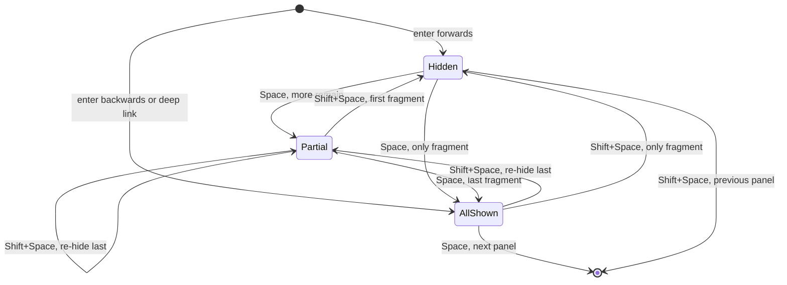

# Spec: `@logosdx/slides`, HTML-native presentation primitives


## Goal


A new package, `@logosdx/slides`, turns `<slides>`, `<slide>`, and `<notes>` markup into a two-axis, keyboard-driven deck whose slides grow and scroll instead of clipping. Authors load it with one `<link>` and one `<script>`. Done means the package builds to `dist/browser/{bundle.js,slides.css}`, the jsdom and Chromium suites below pass, the docs surfaces describe it, and `packages/slides/demo/index.html` exercises every feature by double-click after `pnpm build`.


## Non-goals


- Everything the design lists under *v1 scope → Deferred*: zoom/camera layer, presenter timer and remote view, second-device notes, persistent column chrome, transitions beyond scroll, a Markdown adapter, fragment ordering (`data-fragment-index`) and reveal styles.
- A `HookEngine` plugin surface. Extensions subscribe to `Deck.on()` events.
- A `BroadcastChannel` or `postMessage` notes transport. The deck writes the popup DOM directly.
- Firefox-specific work. Chromium is the automated target; WebKit and phones are hand-checked through the demo.
- A theme framework. One neutral stylesheet plus the custom properties in *Authoring surface*.
- Embedded, inline, or multiple decks per document.
- Custom element registration (`customElements.define`).
- An npm stylesheet import. No `./slides.css` package export; authors link `dist/browser/slides.css`.
- A static accessor for the auto-created deck. CDN authors who need events write `<slides manual>` and construct `Deck` themselves.
- Generated slide ids or index attributes. Column, panel, and fragment indices are internal state.
- Running smoke tests in CI.


## Success criteria


### Package and build

- [ ] `packages/slides/package.json` names `@logosdx/slides`, sets `browserNamespace: "LogosDx.Slides"`, `"sideEffects": false`, and depends on `@logosdx/utils`, `@logosdx/dom`, `@logosdx/observer` as `workspace:^`.
- [ ] `pnpm build` from the repo root is green and produces `packages/slides/dist/browser/bundle.js`, `dist/browser/slides.css`, and `slides.css` in `dist/cjs` and `dist/esm`.
- [ ] `scripts/build.mjs` copies every `src/*.css` file into `PATHS.BROWSER` after the Vite step, for any package; packages without CSS build the same `dist/browser` output as before.
- [ ] `scripts/vite.config.ts` uses `src/browser.ts` as the IIFE entry when the package has one, else `src/index.ts`.
- [ ] Every package's `dist/browser/bundle.js` declares no top-level binding other than the `LogosDx` namespace, so a page script's own globals (`const s`, `function h()`) neither break nor alter the bundle.
- [ ] `src/index.ts` has no side effects and no top-level `document` or `window` access, so the build's Node import of `dist/esm` and `dist/cjs` succeeds and finds exports.
- [ ] Importing `src/index.ts` in jsdom creates no `Deck`, attaches no listeners, and mutates no DOM, with or without a `<slides>` in the document.
- [ ] Loading `dist/browser/bundle.js` with a `<slides>` present creates the deck on DOM ready and sets `data-ready`; with `<slides manual>`, no deck is created.

### Authoring surface

| Element | Placement | Meaning |
|---|---|---|
| `<slides>` | one per document | The deck. Owns the viewport. |
| `<slide horizontal>` | child of `<slides>` | A column. A column with no vertical children is itself the panel. |
| `<slide vertical>` | child of a column | A panel. `min-height: 100%`, grows and scrolls. |
| `<notes>` | inside any slide | Speaker notes. Never rendered in the deck. |

| Attribute | On | Set by | Meaning |
|---|---|---|---|
| `horizontal` / `vertical` | `slide` | author or upgrade | Axis. |
| `fragment` | any element in a slide | author | Step-revealed. |
| `revealed` | `[fragment]` | JS | Fragment is shown. |
| `active` | panel | JS | Current panel. |
| `data-ready` | `slides` | JS | Deck initialized. Gates fragment hiding. |
| `data-implicit` | `slide` | upgrade | Panel synthesized from loose content. |
| `manual` | `slides` | author | Skip auto-init. |

Theming custom properties on `slides`: `--slide-padding`, `--slide-bg`, `--slide-fg`, `--deck-font`.

A `<notes>` placed directly in a column belongs to the panel before it; leading notes before the column's first panel belong to that first panel. Notes are never loose content for case 7.

### Stylesheet

- [ ] With only `slides.css` loaded, columns snap horizontally and panels snap vertically (`mandatory` on both axes, `scroll-snap-stop: always`).
- [ ] A reader can rest at any scroll offset inside a panel taller than the viewport.
- [ ] A column left straddling two panels settles on a panel edge.
- [ ] Deck height is `100dvh`; `notes` is `display: none` unconditionally; unrevealed `[fragment]` elements are hidden only under `slides[data-ready]`.
- [ ] `@media print` linearizes the deck: no snapping, no fixed heights, one page break per panel, every fragment visible, notes and overlays hidden.
- [ ] `@media (prefers-reduced-motion: reduce)` disables smooth scrolling, and JS navigation does not request smooth scrolling under it.

### Upgrade

Runs once per `<slide>` at construction and for slides added to the root later. A `<slide>` whose parent is neither `<slides>` nor `<slide>` is misplaced.

| # | Case | Result |
|---|---|---|
| 1 | Misplaced, explicit `horizontal` | Moves, with its following siblings, to after its column, as a column. |
| 2 | Misplaced, explicit `vertical` | Moves, with its following siblings up to the first explicit `horizontal` one, into its column as a panel, after the column child that contains it. |
| 3 | Misplaced, no axis attribute | Moves, with its following siblings up to the first explicit `horizontal` one, to after its nearest `<slide>` ancestor, as that ancestor's sibling. |
| 4 | `<slide>` directly inside a panel | Moves to become the next sibling panel after its parent panel; several in one panel keep their order. |
| 5 | Axis attribute absent | Inferred from the parent (child of `<slides>` is `horizontal`, child of a slide is `vertical`) and written back. |
| 6 | Axis attribute contradicts position (`<slide vertical>` directly in `<slides>`, `<slide horizontal>` directly in a column) | Position wins: the attribute is rewritten to match the position. |
| 7 | Non-whitespace content other than `<notes>` before a column's first panel | Wrapped into `<slide vertical data-implicit>`. Content between or after panels stays in place. |

Cases 1-4 each log one `console.warn` naming the slide that triggered the case; siblings carried along are not warned again. Cases 2 and 3 never carry an explicit `horizontal` sibling: it is repaired by its own case 1. Case 6 logs one `console.warn` naming the rewritten slide. A second `<slides>`, including one nested inside the root, logs `console.error`, and neither it nor its slides are upgraded.

- [ ] Each case in the table holds on raw HTML fed through `innerHTML` or `DOMParser`, including unclosed `<p>` and unclosed `<li>` inside a column and inside a panel.
- [ ] Cases 1-4 log one `console.warn` per triggering slide; an explicit `horizontal` sibling stays a column.
- [ ] Well-formed contradictory markup (case 6) ends with the attribute matching the position and one `console.warn` per rewritten slide.
- [ ] Whitespace-only text and comments are not wrapped by case 7.
- [ ] A second `<slides>`, sibling or nested inside the root, logs `console.error` and is left untouched, slides included.
- [ ] Constructing a second `Deck` while one is live throws; after `destroy()` a new `Deck` constructs.
- [ ] `data-ready` is set on `<slides>` after upgrade and removed by `destroy()`.

### Public API and events

Exported from `@logosdx/slides` and `window.LogosDx.Slides`:

| Member | Behavior |
|---|---|
| `new Deck(root?)` | `root` is the `<slides>` element, defaulting to the first in the document. Throws when another `Deck` is live, no `<slides>` exists, or `root` is not a `<slides>` element. Upgrades the tree, sets `data-ready`, binds keys, applies the hash. |
| `deck.next()` | Same as `Space`: next fragment, else next panel, else next column. No-op at the end. |
| `deck.prev()` | Same as `Shift+Space`. No-op at the start. |
| `deck.nextColumn()` / `deck.prevColumn()` | Same as `→` / `←`. |
| `deck.goTo(target)` | `target` is an element id or `{ column, panel, fragment? }` (0-based; `fragment` is the revealed count, omitted means all). An id resolves to the panel containing that element; an element in a column but outside any panel resolves to the panel before it in that column, or the column's first panel when none precedes it. Throws on an unknown id or out-of-range position. |
| `deck.on(event, listener)` | Subscribes; returns a cleanup. |
| `deck.destroy()` | Removes listeners, observers, overlays, `data-ready`, and `active`; closes the notes popup; releases the singleton. Repairs and implicit wraps stay. |
| `Deck` namespace types | Event map, `goTo` target, listener types. |

| Event | Payload | Fires |
|---|---|---|
| `deck:ready` | `{ slide }` | Once, asynchronously, with the initial active panel: after construction, or when the first panel appears in a deck constructed empty. A deck destroyed before it fires emits none. |
| `slide:leave` | `{ slide, column, panel }` | Before `slide:enter` on each active-panel change. |
| `slide:enter` | `{ slide, column, panel }` | After each active-panel change. |
| `fragment:show` | `{ slide, fragment, index }` | Per fragment revealed by a fragment step (`Space`, `next()`, or `goTo` with a `fragment` count on the active panel), including a step on a pending move's target, which emits immediately; `index` is its 0-based position in the panel. Entering a panel sets its fragments without events. |
| `fragment:hide` | `{ slide, fragment, index }` | Per fragment re-hidden by a fragment step. |

Events are delivered through an internal `ObserverEngine`.

- [ ] Exactly one panel carries `active` from `deck:ready` on, maintained through `watchVisibility()`, including panels added after construction. No `scroll` or `scrollend` listeners. A key or API move whose deck and column offsets hold still for 10 animation frames without its target at the center is released, and so is any move on `wheel`, `touchstart`, or `pointerdown`.
- [ ] A move interrupted by focus, find-in-page, an author `scrollTo`, or a scrollbar drag leaves the panel at the center `active`, and the next key steps from it.
- [ ] When a pending move's target is removed, the move continues to the first panel of the target's former column while that column is in the deck (a column left with no vertical children is itself that panel), and is released when the column is gone. A hand-off to the panel that is already active ends the move with no events.
- [ ] `slide:leave` then `slide:enter` fire once per active-panel change; `deck:ready` fires once per `Deck`, after construction returns.
- [ ] `on()` returns a cleanup that stops delivery.
- [ ] After `destroy()`, keys do nothing, no panel carries `active`, overlays are gone, and the notes popup is closed.

### Keyboard

| Key | Action |
|---|---|
| `→` / `←` | Next / previous column, landing on its first panel. |
| `↓` / `↑` | Scroll the column if the panel extends past the viewport in that direction; at the panel edge, move to the next / previous panel in the column. No-op at the column's last / first panel edge. |
| `Space` / `Shift+Space` | `next()` / `prev()`. |
| `PageDown` / `PageUp` | Next / previous panel in reading order, crossing columns, ignoring fragments and scroll position. |
| `Home` / `End` | First panel of the first column / last panel of the last column. |
| `S` | Open, or reopen, the notes popup. |
| `F` | Toggle fullscreen. |
| `.` / `B` | Toggle a blank screen. |
| `?` | Toggle the key help overlay, which says that `S` reopens notes. |
| `Esc` | Close the help overlay or unblank. |

Panel moves use `scrollIntoView()`.

- [ ] Every key in the table does what it says, in Chromium.
- [ ] `↓` / `↑` inside a tall panel scroll the column first and advance only at the panel edge.
- [ ] Keys are ignored when the event target is an `input`, `textarea`, `select`, `button`, `summary`, `audio[controls]`, `video[controls]`, or `contenteditable` element, and when Ctrl, Meta, or Alt is held.

### Fragments

Navigation is forwards when the new active panel comes after the previous active panel in reading order, and backwards otherwise. The rule applies to keys, `next()` / `prev()` / `nextColumn()` / `prevColumn()`, mouse, and touch scroll. `goTo` and hash navigation follow their own reveal rules (see *Public API and events* and *URL*). Entering forwards hides all of a panel's fragments. Entering backwards reveals all of them. A panel with no fragments has no fragment state.

The first activation after load depends on the hash:

| Hash on load | Initial panel's fragments |
|---|---|
| none (the URL has no `#`) | Entered forwards: all hidden. |
| `#/<column>/<panel>` or `#<id>` | Deep link: all revealed. |
| `#/<column>/<panel>/<fragment>` | `<fragment>` revealed. |
| bare `#`, malformed, out-of-range, or unmatched | As none: all hidden. |



- [ ] Fragments follow the diagram; `PageDown` / `PageUp` and `→` / `←` skip fragment steps.
- [ ] `fragment:show` / `fragment:hide` fire once per fragment step, never for entry resets or for a move that does not arrive.

### URL

| Hash | Meaning |
|---|---|
| `#/<column>/<panel>` | 0-based position; all fragments revealed. |
| `#/<column>/<panel>/<fragment>` | Position with `<fragment>` fragments revealed. |
| `#<id>` | The panel containing the element with that id (a slide or any element inside one), resolved as `goTo` resolves ids; all fragments revealed. |

The deck always writes the positional form, adding the fragment segment when the active panel has fragments. A malformed or out-of-range positional hash logs `console.warn` and leaves the deck where it is. An `#<id>` that matches nothing, and a bare `#` (for example an `<a href="#">` placeholder), leave the deck where it is, silently. A deck constructed empty applies the hash and the first-activation table when its first panel appears.

- [ ] Both hash forms deep-link on load and on `hashchange`.
- [ ] `#<id>` of an element inside a panel lands on that panel; an unmatched id changes nothing.
- [ ] Moving to a different panel adds one history entry; a fragment step replaces the current entry; browser back and forward return to the prior panel.

### Speaker notes

- [ ] `S` opens a popup named `lx-notes` and writes the active panel's notes, a preview of the next panel, the column, panel, and fragment position, and elapsed and wall-clock time into it.
- [ ] The popup updates on every change to the active panel or its revealed count while connected, including `goTo` and hash navigation that change the count without fragment events.
- [ ] Closing or reloading the popup marks it disconnected and stops writes without throwing; pressing `S` again closes the stale window and opens a working one.

### Demo, hand checks, and docs

- [ ] `packages/slides/demo/index.html` loads `../dist/browser/slides.css` and `../dist/browser/bundle.js` and works from `file://` after `pnpm build`. It contains a tall slide, a vertical stack, loose column content, an unclosed `<p>` repair case, fragments, notes, and a live `<input>`.
- [ ] Hand-checked in the demo from `file://` in Chromium:
    - reloading the notes popup, then pressing `S`, brings notes back
    - `F` enters and leaves fullscreen
    - print preview shows the linearized layout
    - with OS reduced motion on, navigation jumps without smooth scrolling
- [ ] Hand-checked on iOS Safari and Android Chrome: touch flings stop at each panel and do not overshoot out of a tall panel.
- [ ] `docs/packages/slides.md` (with the CDN `<link>` and `<script>`, and for npm users the `node_modules/@logosdx/slides/dist/browser/slides.css` path to link or copy), `skills/logosdx/references/slides.md`, the `SKILL.md` routing table and scope list, the VitePress sidebar, and `scripts/build-docs.mjs` `packageDescriptions` all cover the package.
- [ ] `.changeset/` holds one `minor` entry for `@logosdx/slides` and one `patch` entry for every other package whose browser bundle changed, naming the global-leak fix and the es2022 browser floor.
- [ ] From the repo root, `pnpm build` is green; `pnpm test` and `cd tests && pnpm test:smoke` pass every slides test file and add no failures outside them.


## Approach


Unregistered `<slides>` / `<slide>` elements upgraded through `@logosdx/dom` `observe()`, laid out entirely by CSS scroll-snap, with JS coordinating navigation, fragments, URL, and notes. See `docs/design/slides.md`.


## Change tree


```
packages/slides/
├── package.json ............. A  (@logosdx/slides, LogosDx.Slides)
├── tsconfig.json ............ A  (from internals/empty-pkg)
├── .swcrc ................... A  (from internals/empty-pkg)
├── typedoc.json ............. A  (mirrors packages/dom/typedoc.json)
├── LICENSE .................. A
├── src/
│   ├── index.ts ............. A  (side-effect-free exports)
│   ├── browser.ts ........... A  (IIFE entry: index re-export + auto-init)
│   ├── types.ts ............. A  (Deck namespace types)
│   ├── deck.ts .............. A  (Deck class)
│   ├── upgrade.ts ........... A  (repair, axis, implicit wrap)
│   ├── keys.ts .............. A  (key map, input guard)
│   ├── fragments.ts ......... A  (fragment state machine)
│   ├── url.ts ............... A  (hash parse/format)
│   ├── notes.ts ............. A  (notes popup)
│   ├── overlays.ts .......... A  (help, blank)
│   └── slides.css ........... A  (layout, print, reduced motion)
└── demo/
    └── index.html ........... A  (hand-check deck)
scripts/
├── build.mjs ................ M  (copy src/*.css into dist/browser)
├── vite.config.ts ........... M  (src/browser.ts entry when present; target es2022, no transpile helpers)
└── build-docs.mjs ........... M  (slides packageDescriptions entry)
pnpm-lock.yaml ............... M  (new workspace package)
tests/src/
├── slides/
│   ├── _helpers.ts .......... A  (IntersectionObserver and scrollIntoView stubs)
│   ├── upgrade.test.ts ...... A
│   ├── deck.test.ts ......... A  (singleton, data-ready, ESM no-op)
│   ├── fragments.test.ts .... A
│   ├── url.test.ts .......... A
│   ├── keys.test.ts ......... A
│   └── notes.test.ts ........ A
└── smoke/
    ├── globals.d.ts ......... A  (typed LogosDx bundle globals)
    ├── setup.ts ............. M  (stylesheet loader; bundle loader takes a document)
    ├── bundle-scope.test.ts . A  (every bundle declares only LogosDx)
    ├── slides.test.ts ....... A
    └── slides-init.test.ts .. A  (auto-init cases)
docs/
├── design/slides.md ........ M  (repair rules, stalled-move release)
├── getting-started.md ....... M  (package list)
├── packages/slides.md ....... A
└── .vitepress/config.mts .... M  (sidebar entry)
readme.md .................... M  (package list)
skills/logosdx/
├── SKILL.md ................. M  (routing row, scope list, triggers)
├── references/REFERENCE.md .. M  (package row)
└── references/slides.md ..... A
.changeset/slides-package.md . A  (minor @logosdx/slides)
.changeset/bundle-scope.md ... A  (patch: CDN bundles stop leaking globals, es2022 floor)
```


## Outline


```
packages/slides/src/index.ts
  public exports — Deck, Deck namespace types; no side effects

packages/slides/src/browser.ts
  re-export — everything from index
  autoInit — construct Deck on DOM ready for a non-manual <slides>

packages/slides/src/types.ts
  Deck.EventMap — event names to payloads
  Deck.Target — element id or { column, panel, fragment? }

packages/slides/src/deck.ts
  Deck — singleton coordinator for one <slides>
    constructor — singleton check, upgrade, data-ready, bindings, initial hash
    next / prev — universal advance and retreat
    nextColumn / prevColumn — column moves
    goTo — move to an id or position
    on — event subscription with cleanup
    destroy — teardown and singleton release
    active tracking — watchVisibility over panels, active attribute, direction, enter/leave events

packages/slides/src/upgrade.ts
  repairMisplaced — upgrade cases 1-4
  inferAxis — cases 5-6, warning on contradiction
  wrapLooseContent — case 7
  upgradeDeck — run all over a root, error on extra <slides>

packages/slides/src/keys.ts
  isGuardedTarget — editable and interactive element guard
  keyAction — key event to deck action, modifiers excluded

packages/slides/src/fragments.ts
  fragment state — hidden / partial / all-shown per panel
    step forward / back — reveal or re-hide one, report when exhausted
    enter — forwards hides all, backwards or deep link reveals all

packages/slides/src/url.ts
  parseHash — hash to position or id
  formatHash — position to hash

packages/slides/src/notes.ts
  NotesWindow — popup lifecycle and direct DOM writes
    open — close stale window, open lx-notes, write view
    render — notes, next-panel preview, position, clocks
    connection check — closed or unreadable document marks disconnected

packages/slides/src/overlays.ts
  help overlay — key table, S reopen hint
  blank overlay — full-screen blank toggle

packages/slides/src/slides.css
  deck layout — x mandatory snap, 100dvh, custom properties
  column layout — y mandatory snap, own scroll
  panel layout — min-height 100%, snap stop
  notes and fragment hiding — unconditional notes, data-ready-gated fragments
  overlays — help and blank styling
  print — linearized pages
  reduced motion — no smooth scroll

packages/slides/demo/index.html
  demo deck — tall slide, vertical stack, loose content, unclosed <p>, fragments, notes, <input>

scripts/build.mjs
  css copy step — src/*.css into PATHS.BROWSER, after the Vite step

scripts/vite.config.ts
  entry selection — src/browser.ts when present, else src/index.ts
  target — es2022, so the IIFE needs no transpile helpers in page scope

tests/src/smoke/setup.ts
  stylesheet loader — inject a package's dist/browser/*.css
  bundle loader — load a package bundle into a given document; __fetchPackageAsset reads its text

tests/src/smoke/bundle-scope.test.ts
  per package — only LogosDx added to the window, page globals untouched, source is one namespace assignment

tests/src/slides/upgrade.test.ts
  upgrade cases 1-4 — raw HTML repair, warnings, order kept
  axis inference — case 5
  contradictory axis — case 6, position wins, one warning
  implicit wrap — case 7, whitespace and comments skipped
  second <slides> — console.error, untouched

tests/src/slides/deck.test.ts
  singleton — second construction throws, destroy releases
  data-ready — set on construct, removed on destroy
  ESM import — no deck, no listeners, no DOM change

tests/src/slides/fragments.test.ts
  state machine — forward, backward, deep-link entry; single fragment; step and re-hide; events

tests/src/slides/url.test.ts
  parse / format — positional, fragment segment, id, malformed input
  id resolution — element inside a panel, unmatched id

tests/src/slides/keys.test.ts
  guard — guarded targets and modifiers ignored
  key map — each key resolves to its action

tests/src/smoke/slides-init.test.ts
  auto-init — <slides> creates the deck and data-ready; <slides manual> does not

tests/src/smoke/slides.test.ts
  CSS only — tall-panel rest, straddle settles on an edge, fragments visible, notes hidden
  scroll before advance — ↓ scrolls, then advances at edge
  navigation keys — → ← ↓ ↑ PageDown PageUp Home End
  overlay keys — . B ? Esc
  active tracking — active attribute and enter/leave order
  on cleanup — no delivery after cleanup
  fragments and URL — reveal, hash, back / forward
  notes popup — open, write, reload disconnect, reopen
  destroy — no key response, no active, overlays removed, popup closed

docs/packages/slides.md
  Installation — CDN link and script; npm install, then link or copy node_modules/@logosdx/slides/dist/browser/slides.css
  Quick start — minimal deck
  Elements and attributes — reference tables
  Keyboard — key table
  Fragments, URL, speaker notes — behavior
  Deck API and events — manual mode
  Authoring rules — close <p> and <li>, repair warnings
  Theming and print — custom properties, print output

skills/logosdx/references/slides.md
  slides reference — elements, attributes, API, events, authoring pitfalls

skills/logosdx/SKILL.md
  routing row — slides tasks to references/slides.md
  scope list and triggers — slides, Deck

docs/.vitepress/config.mts
  sidebar — Slides entry

scripts/build-docs.mjs
  packageDescriptions — slides entry

.changeset/slides-package.md
  minor bump — new @logosdx/slides package

.changeset/bundle-scope.md
  patch bump — CDN bundles stop leaking globals, es2022 browser floor
```


## Flows


**Flow: CDN auto-init**

1. Author's page loads `slides.css`; the deck lays out and scrolls with no JS.
2. `bundle.js` (built from `src/browser.ts`) runs and waits for DOM ready.
3. Auto-init finds a `<slides>` without `manual` and constructs `Deck`.
4. `Deck` upgrades the tree, sets `data-ready` (unrevealed fragments hide), binds keys, and applies the hash.
5. `deck:ready` fires with the initial active panel.

**Flow: manual init**

1. Author writes `<slides manual>`, or imports `@logosdx/slides`.
2. Author calls `new Deck()` and subscribes with `deck.on(...)` before `deck:ready` fires.
3. Author calls `deck.destroy()`; listeners, overlays, and `data-ready` are removed and a new `Deck` may be constructed.

**Flow: parser repair**

1. Author writes `<slide><p>one</slide><slide>two</slide>` inside `<slides>`.
2. The HTML parser nests slide `two` inside the open `<p>`.
3. Upgrade sees slide `two` with a `<p>` parent and no axis attribute, moves it and its following siblings after slide `one`, and logs `console.warn` naming it.
4. Axis inference marks both slides `horizontal`.

**Flow: reading a tall panel by keyboard**

1. Presenter presses `↓` on a panel taller than the viewport.
2. The deck scrolls the column one step, never past the panel's bottom edge.
3. Presenter presses `↓` with the panel's bottom edge in view.
4. The deck calls `scrollIntoView()` on the next panel; `slide:leave` and `slide:enter` fire; the hash gains a history entry.

**Flow: fragments**

1. Presenter enters a panel forwards; all fragments are hidden.
2. Each `Space` reveals one fragment, fires `fragment:show`, and replaces the hash's fragment segment.
3. `Space` after the last fragment moves to the next panel.
4. `Shift+Space` back into the panel reveals every fragment; the next `Shift+Space` re-hides the last one and fires `fragment:hide`.

**Flow: deep link and history**

1. Reader opens `deck.html#/2/1/3`.
2. The deck lands on column 2, panel 1, with 3 fragments revealed.
3. Reader moves two panels forward, then presses browser back.
4. `hashchange` moves the deck to the prior panel without adding an entry.

**Flow: speaker notes**

1. Presenter presses `S`; the deck opens `lx-notes` and writes notes, next-panel preview, position, and clocks.
2. Each `slide:enter` or fragment event rewrites the view.
3. Presenter reloads the popup; the next write finds it unreadable or empty and marks it disconnected.
4. Presenter presses `S`; the deck closes the stale window, opens a fresh one, and writes the current state.


## Checkpoints


| # | Checkpoint | Files/areas | Agent | Est. files | Verifies |
|---|------------|-------------|-------|------------|----------|
| 1 | Package scaffold, `slides.css`, build CSS copy, minimal `Deck` export, CSS-only demo skeleton | `packages/slides/{package.json,tsconfig.json,.swcrc,typedoc.json,LICENSE,src/index.ts,src/slides.css,demo/index.html}`, `scripts/build.mjs`, `pnpm-lock.yaml`, `tests/src/smoke/{setup.ts,slides.test.ts}` | atomic-implementer (mode: feature) | ~11 | `pnpm install && pnpm build` green, including export validation; `dist/browser/slides.css` present; other packages' `dist/browser` unchanged; `cd tests && pnpm test:smoke`: tall-panel rest, straddle settles on an edge, fragments visible and notes hidden without JS |
| 2 | Upgrade, repair, implicit wrap, singleton, `data-ready`, IIFE entry with auto-init | `packages/slides/src/{upgrade.ts,deck.ts,types.ts,index.ts,browser.ts}`, `scripts/vite.config.ts`, `tests/src/slides/{upgrade,deck}.test.ts`, `tests/src/smoke/slides-init.test.ts` | atomic-implementer (mode: feature) | ~9 | `pnpm build && pnpm test`: upgrade cases 1-7, singleton, ESM no-op; `cd tests && pnpm test:smoke`: `<slides>` auto-inits with `data-ready`, `<slides manual>` does not |
| 3 | Active tracking, events, navigation, keyboard, help and blank overlays, fullscreen | `packages/slides/src/{deck.ts,keys.ts,overlays.ts,slides.css}`, `tests/src/slides/keys.test.ts`, `tests/src/smoke/slides.test.ts` | atomic-implementer (mode: feature) | ~6 | `pnpm test`: `keys.test.ts`; `cd tests && pnpm test:smoke`: scroll before advance, `→ ← ↓ ↑ PageDown PageUp Home End`, `. B ? Esc`, active tracking and event order, `on()` cleanup |
| 4 | Fragments and URL sync | `packages/slides/src/{fragments.ts,url.ts,deck.ts}`, `tests/src/slides/{fragments,url}.test.ts`, `tests/src/smoke/slides.test.ts` | atomic-implementer (mode: feature) | ~6 | `pnpm test`: `fragments.test.ts`, `url.test.ts` including id resolution; `cd tests && pnpm test:smoke`: fragment reveal, hash writes, back and forward |
| 5 | Speaker notes popup with disconnect and reopen, `destroy()` teardown | `packages/slides/src/{notes.ts,deck.ts,keys.ts,overlays.ts}`, `tests/src/smoke/slides.test.ts` | atomic-implementer (mode: feature) | ~5 | `cd tests && pnpm test:smoke`: notes open, write, reload disconnect, reopen; `destroy()` leaves no key response, no `active`, no overlays, popup closed |
| 6 | Docs, skill reference, changeset, demo completion | `docs/packages/slides.md`, `docs/.vitepress/config.mts`, `skills/logosdx/{SKILL.md,references/slides.md}`, `scripts/build-docs.mjs`, `.changeset/slides-package.md`, `packages/slides/demo/index.html` | atomic-implementer (mode: feature) | ~7 | `pnpm docs:build` green; demo covers every feature in *Demo, hand checks, and docs*; `pnpm build && pnpm test` and `cd tests && pnpm test:smoke` green |


## Risks


| Risk | Likelihood | Mitigation |
|------|-----------|-----------|
| Touch flings on iOS Safari and Android Chrome overshoot panels or skip `scroll-snap-stop` under `y mandatory`. No automated coverage. | med | Hand-checked on both phones through the demo before release; any fix stays in `slides.css`. |
| CI runs only the unit project, so a smoke regression can merge unnoticed. | med | Every checkpoint runs `cd tests && pnpm test:smoke` locally; wiring smoke into CI is out of scope. |
| The Vite lib build empties `dist/browser`, deleting a CSS file copied before it. | high | The CSS copy runs after the Vite step. |
| Auto-init leaks into the ESM or CJS entry, or `src/index.ts` touches `document` at import and fails the build's Node export check. | med | Auto-init lives only in `src/browser.ts`; `deck.test.ts` asserts the ESM no-op; `pnpm build` runs the Node import. |
| jsdom lacks `IntersectionObserver` and `scrollIntoView`, so constructing a `Deck` in a unit test throws. | high | `tests/src/slides/_helpers.ts` stubs both for the slides unit files. |
| `window.open` from the Vitest browser iframe is blocked without real user activation. | med | Trigger `S` through Vitest's `userEvent`, which goes through Playwright input and carries activation. |
| Smooth scrolling and `IntersectionObserver` make smoke assertions timing-dependent. | high | Assert with `expect.poll` or event waits, never fixed sleeps; set a fixed viewport size in the smoke files. |
| Tests resolve workspace packages from `dist/`, so a stale bundle fails new tests. | med | Every checkpoint runs `pnpm build` before testing. |
| An engine pauses a smooth scroll for 10 or more frames mid-move, so a normal move is released early and crossed panels fire `slide:enter`. | low | Measured stalls in Chromium and WebKit are at most 3 frames at start-up and 1 mid-flight; the smoke suite asserts no intermediate enters on a two-leg move; phones are hand-checked. |
| Chromium and WebKit resolve a straddling rest to different panel edges. | low | Navigation never relies on snap resolution; every move is an explicit `scrollIntoView()`. The straddle smoke case asserts an edge, not which one. |
| HTML later standardizes `<slide>` or `<slides>`. | low | Upgrade targets element names in one place, so an alias is a small change. |


## Change log

### 2026-10-05 — Suite criterion scoped to slides

**What changed:** The final criterion requires every slides test file to pass and no new failures elsewhere, instead of a fully green suite.

**Why:** The branch baseline already fails 18 unit tests (`window.localStorage.clear is not a function` in react and storage tests) and 22 Chromium smoke tests (hooks, localize, state-machine), none related to slides.

**Superseded:** `pnpm build && pnpm test` green and `cd tests && pnpm test:smoke` green.

### 2026-10-05 — Repair carry, nested decks, empty-deck ready

**What changed:** Cases 2 and 3 stop carrying siblings at the first explicit `horizontal` slide. Warnings are one per triggering slide. A `<slides>` nested inside the root is left untouched along with its slides. `deck:ready` is not emitted for an empty deck or after an early `destroy()`. `new Deck(root)` rejects a non-`<slides>` root.

**Why:** Checkpoint 2 review: a carried explicit `horizontal` slide was demoted to a panel, a nested `<slides>` had its slides pulled into the root, and an empty deck has no panel for the `deck:ready` payload.

**Superseded:** Cases 2 and 3 carried every following sibling; `deck:ready` fired once per `Deck` unconditionally.

### 2026-10-05 — Late panels, ready timing, id resolution

**What changed:** Active tracking covers panels added after construction. `deck:ready` fires when the first panel appears in a deck constructed empty. An id on an element outside any panel resolves to the preceding panel in its column.

**Why:** Checkpoint 3 review: late panels were navigable but never tracked, freezing `active`; content left between panels by case 7 had no defined id target.

**Superseded:** A deck with no slides at construction never emitted `deck:ready`.

### 2026-10-05 — scrollend releases stalled moves

**What changed:** The active-tracking criterion allows a `scrollend` listener whose only job is to release a pending move that stopped short (focus scroll, find-in-page, author `scrollTo`, scrollbar drag).

**Why:** Checkpoint 3 review: without it, an interrupted move froze `active`.

**Superseded:** No scroll listeners of any kind.

### 2026-10-05 — Fragment events, bare hash, late landing

**What changed:** `fragment:show` / `fragment:hide` fire only for fragment steps; entering a panel sets fragments silently. The direction rule names its sources; `goTo` and hash navigation keep their own reveal rules. A bare `#` is treated as an unmatched id. A deck constructed empty lands on the hash when its first panel appears.

**Why:** Checkpoint 4 review: entry resets fired fragment events before `slide:enter` and for moves that never arrived; `<a href="#">` reset the deck; a deep link into a deck rendered after construction was ignored.

**Superseded:** Fragment events fired for every fragment state change, including entry; an empty hash meant the deck start.

### 2026-10-05 — Stalled moves released by stillness, not scrollend

**What changed:** A pending move is released when the deck and target column offsets hold still for 10 animation frames with the target off center, or on `wheel` / `touchstart` / `pointerdown`. No `scroll` or `scrollend` listeners. New criterion for interrupted moves. A fragment step on a pending move's target emits immediately. The notes popup redraws on every active-panel or revealed-count change.

**Why:** Checkpoint 4 review: each `scrollend` filter that closed the ←→ race opened a false negative (focus scroll back to start, a cancelled column leg). A per-frame stillness check passed every scenario in Chromium and WebKit probes.

**Superseded:** A `scrollend` listener released a move that stopped short.

### 2026-10-06 — Leading notes, change tree

**What changed:** Leading `<notes>` before a column's first panel belong to that panel and are not wrapped by case 7. The case 2/3 carry rule is worded to match case 1. The change tree lists the helper, typings, notes test, and doc files the build added.

**Why:** Final audit: a column whose only lead-in was `<notes>` gained a blank implicit panel.

**Superseded:** Case 7 wrapped any non-whitespace content, `<notes>` included.

### 2026-10-06 — CDN bundle keeps helpers inside the IIFE

**What changed:** New criterion: every package's browser bundle declares no top-level binding besides `LogosDx`. The fix lives in `scripts/vite.config.ts` and applies to all packages.

**Why:** Final audit: the minified IIFE hoisted transpile helpers (`var ci`, `var s`, `var h`) into page scope, so a hand-written deck page that declared one of those names broke or altered the bundle. The CDN `<script>` on hand-written pages is the primary way slides loads.

### 2026-10-06 — Removed move targets, bundle changesets

**What changed:** New criterion for a pending move whose target is removed: hand off to the former column's first panel, release when the column is gone, and end silently when that panel is already active. A `patch` changeset covers every package whose CDN bundle changed with the es2022 target.

**Why:** Follow-up review: the removed-target behavior lived only in code, a hand-off to the active panel re-fired `slide:enter`, and the bundle fix would not publish for the other packages without a changeset.

## Implementation log

### built, unreleased — 2026-10-06

Built across 19 iterations of /subagent-implementation. Commits (chronological):

- `583ba60` — CP-1 package scaffold, CSS-only scroll-snap deck, build CSS copy
- `9b71e5b` — CP-2 upgrade and repair, `Deck` singleton, CDN auto-init
- `33983c3` — CP-3 navigation, keyboard, overlays, active tracking
- `805f176` — CP-4 fragments and URL hash sync, frame-stillness move release
- `fca35e8` — CP-5 speaker notes popup with disconnect and reopen
- `49202e4` — CP-6 package docs, skill reference, changeset, demo
- `f4ead4a` — audit fixes: leading notes go to the first panel
- `1cfde23` — CDN bundles stop leaking globals; removed move targets hand off

**Out-of-scope work performed during this build:**

- `scripts/vite.config.ts` target raised to es2022 for every package, with a `patch` changeset for eight packages: the audit found helper globals leaking from every dotted-name IIFE bundle, and the CDN `<script>` is how slides loads.
- `@logosdx/slides` added to `readme.md` and `docs/getting-started.md` package lists.

**Unforeseens — surprises that emerged during implementation:**

- The branch baseline already failed 18 unit and 22 smoke tests outside slides; the suite criterion was scoped to slides files.
- `scrollend` could not reliably release a move that stopped short (a late event from the previous move, a focus scroll back to start, a cancelled column leg); replaced with a 10-frame stillness check after a strategist review.
- Chromium caps `history.length` at 50, so smoke history assertions count `pushState` calls instead.
- Vite only hoists esbuild helpers into an IIFE assigned with `var`/`const`; dotted library names miss it.

**Deferred items still open:**

- #154 retry jitter flake, #155 memo TTL flake, #156 hooks missing from package lists, #157 localize and react bundles reference `process.env`, #158 hooks has no `.swcrc`.
- Hand checks for the user: notes reload then `S`, `F` fullscreen, print preview, reduced motion, phone flings (see *Demo, hand checks, and docs*).

**Squashed into one commit — 2026-10-06.** Per-iteration SHAs above are historical (unreachable from any branch).
