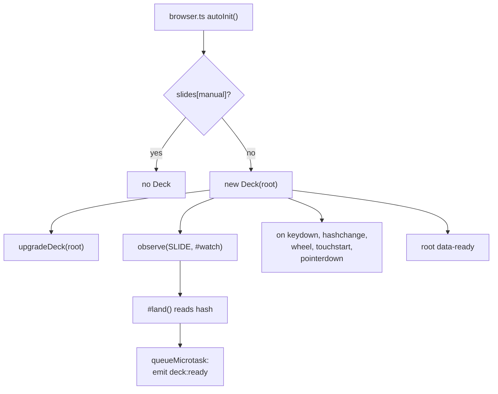
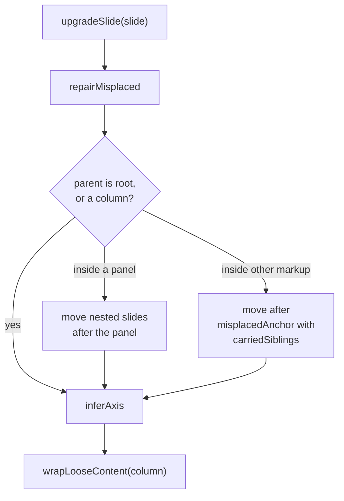
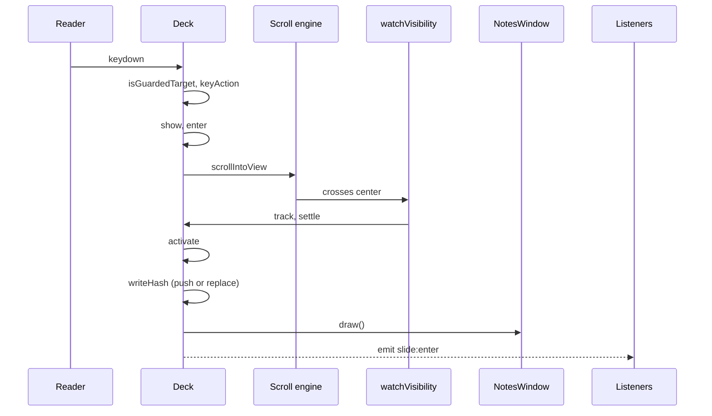
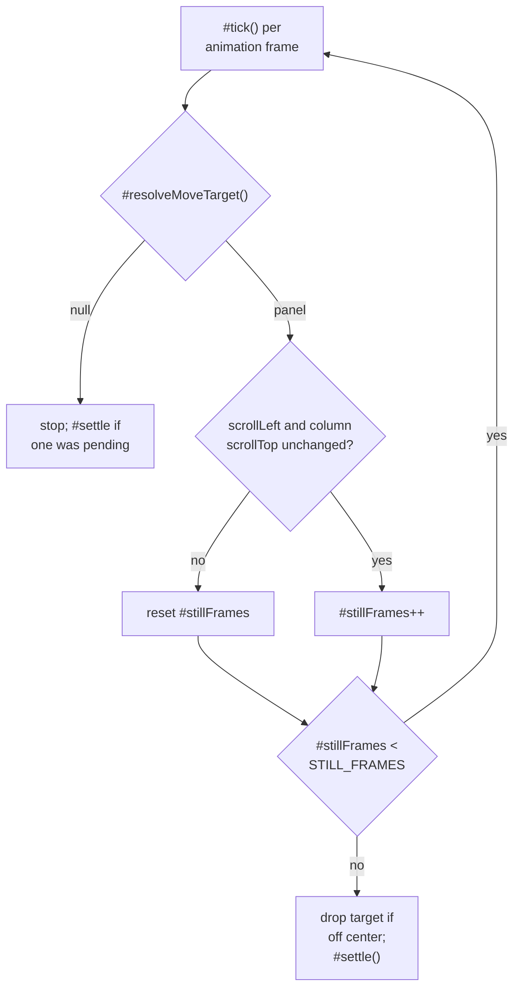
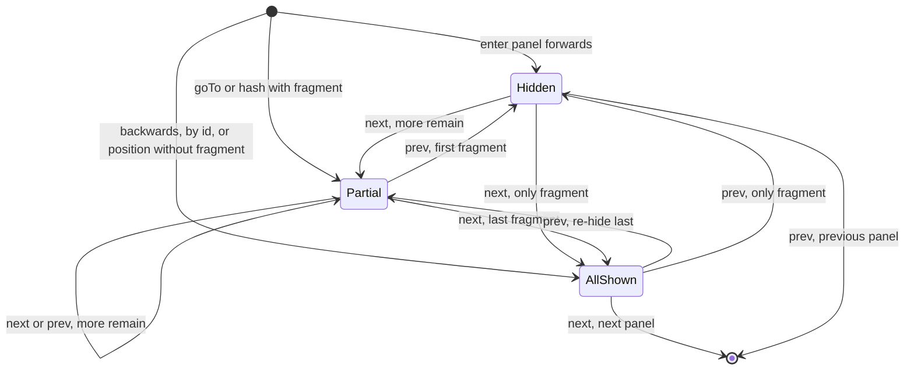
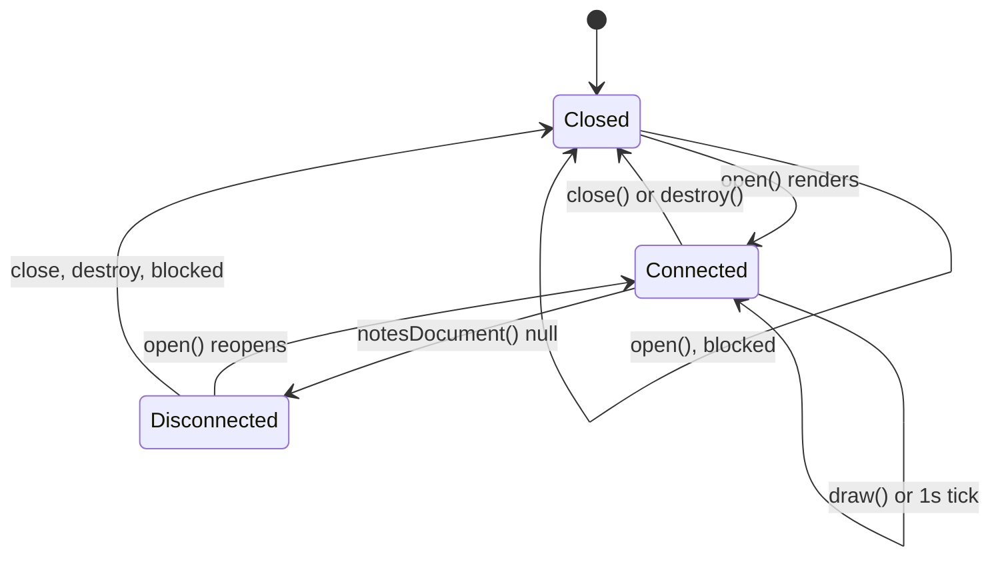

# slides

## What it does

`@logosdx/slides` turns `<slides>`, `<slide>`, and `<notes>` markup into a presentation deck whose panels scroll when their content is taller than the screen, instead of clipping or scaling it down. Horizontal `<slide>` elements are columns; `<slide>` elements nested one level inside a column are panels. The browser's scroll-snap engine positions everything; the `Deck` class coordinates keys, the URL hash, fragments, overlays, and a speaker-notes popup.

The package is CDN-first. A page needs one `<link>` to `dist/browser/slides.css` and one `<script>` to `dist/browser/bundle.js` (namespace `LogosDx.Slides`). The stylesheet alone gives a readable, scrollable, printable document; the script adds navigation. Without it, an agent asked for a deck writes its own key handlers, slide state, and overflow strategy every time.

```html
<slides>
    <slide horizontal><h1>Q3 review</h1></slide>
    <slide horizontal>
        <slide vertical><h2>Revenue</h2><p fragment>Up 12%</p></slide>
        <slide vertical><h2>Detail</h2><notes>Mention churn</notes></slide>
    </slide>
</slides>
```

Contract: `docs/spec/slides.md`. Rationale and measured browser behavior: `docs/design/slides.md`. User docs: `docs/packages/slides.md`.

## How it works

### Load path

The CDN bundle builds the deck on DOM ready, and the first active panel fires `deck:ready` in a microtask. The key, hash, scroll-release, and visibility listeners share one `AbortController`; the upgrade observer stops through the cleanup `upgradeDeck` returns (`#stopUpgrade`), the notes clock is a `setInterval`, and the `requestAnimationFrame` loop exits on `#destroyed`.



`Deck` is a singleton: a static `#live` field makes a second constructor call throw until `destroy()` runs. `data-ready` on the root is what lets `slides.css` hide unrevealed fragments, so a deck whose script never loads shows every fragment.

### Upgrade repairs

`upgradeDeck()` runs `upgradeSlide()` on every `<slide>` under the root, now and as slides are added (via `@logosdx/dom` `observe`). Each slide passes through `repairMisplaced`, `inferAxis`, and `wrapLooseContent` in that order.



Repairs target slides the HTML parser nested inside unclosed `<p>` or `<li>` tags; each move logs a `console.warn`. `inferAxis` writes `horizontal` on a root child and `vertical` on a column child, rewriting a contradicting attribute with a warning, so CSS can select on an attribute rather than on nesting. `wrapLooseContent` wraps content above a column's first panel in a `<slide vertical data-implicit>`, because that content sits outside every snap target otherwise. `destroy()` stops observing but leaves every repair in place.

### Key press to active panel

A key moves the scroller; the panel becomes active only when an `IntersectionObserver` reports it at the deck's center, so panels crossed on the way never fire `slide:enter`.



Messages name `Deck` private methods (`#show`, `#enter`, `#track`, `#settle`, `#activate`, `#writeHash`) without the `#`. `keyAction` maps `KeyboardEvent.key` to a `KeyAction` and returns null for Ctrl, Meta, or Alt combinations. `isGuardedTarget` drops keys whose target sits inside a form control, `summary`, controlled media, or a `contenteditable` element. `↓`/`↑` call `#scrollOrStep`, which scrolls the column by up to `SCROLL_STEP` (0.8) of its height until the panel's edge, then moves to the next panel in the same column. A second key press during a move steps from `#origin()`, the pending target, not the panel still on screen. `#watch` uses `rootMargin: '-50%'`, shrinking the observer root to the deck's center point.

### Releasing a stalled move

A move whose scroll stops short (focus scroll, find-in-page, author `scrollTo`, scrollbar drag) would otherwise freeze `active`; `#tick` lets go once the scrollers hold still with the target off center.



`STILL_FRAMES` is 10. A `wheel`, `touchstart`, or `pointerdown` on the root releases the move at once through `#releaseMove`. `#resolveMoveTarget` hands a target that stopped being a panel to its column's first panel, and drops it when the column left the deck.

### Fragment reveal

The DOM is the fragment state: a `[fragment]` element is shown when it carries `revealed`, and `revealedCount(panel)` counts those. `Space` exhausts a panel's fragments before moving panels, because `stepFragment` returns false at either end and `#step` then calls `#stepPanel`.



`#enter` sets a panel's fragments silently (no events) to 0 when moving forward and to all when moving backward. A landing by id, or by position without a fragment, reveals all (`reveal: fragment ?? Infinity` in `#landingFor`). Only a fragment step, or `goTo()` with an explicit `fragment` that targets the already active panel, emits `fragment:show` / `fragment:hide`; `goTo()` with a fragment on another panel sets the count silently through `#enter`. A panel keeps its revealed count while the reader is elsewhere.

### URL hash

`formatHash` writes `#/<column>/<panel>[/<fragment>]`; column and panel are 0-based, and the fragment segment is the revealed count (0 means none shown). `#writeHash` passes the fragment segment only when the panel has fragments. `parseHash` treats any hash not starting with `#/` as an element id, which `#panelContaining` resolves to the panel holding that element; a malformed `#/…` hash returns null. `#activate` uses `pushState` for a new panel, or `replaceState` when the current hash already names it (browser back, an anchor click); fragment steps always use `replaceState`. An empty hash lands on the first panel with no fragments shown. A positional hash that misses logs a `console.warn`; an unmatched id does not, since it may be any anchor.

### Speaker notes connection

`S` opens a popup with `window.open('', 'lx-notes', ...)` and the deck writes the whole notes view into its `document`. Nothing runs inside the popup, so a reload or close disconnects it and the next `S` press opens a fresh one.



`notesDocument` returns null when `pop.closed` is true, when reading `pop.document` throws (Chromium's reloaded `about:blank` is cross-origin), or when the view element `lx-notes-view` is missing (WebKit). `renderNotes` replaces the whole view on a new slide and updates only position and preview on the same slide, so the presenter's scroll in the notes survives. `notesOf` collects `<notes>` inside the panel plus `<notes>` placed directly in the column after it; notes ahead of a column's first panel belong to that first panel. The next-slide preview is an `importNode` clone with `video`, `audio`, and `iframe` replaced by placeholders. Elapsed time starts at the first open and survives a close.

## Where it lives

| Path | Role |
|---|---|
| `packages/slides/src/deck.ts` | `Deck` class: singleton, navigation API, move tracking, activation, hash sync, overlays, fullscreen |
| `packages/slides/src/types.ts` | `Deck` namespace augmentation: `EventMap`, `SlideChange`, `FragmentChange`, `Position`, `Target` |
| `packages/slides/src/upgrade.ts` | `upgradeDeck`, element names `DECK`/`SLIDE`/`NOTES`, misplaced-slide repair, axis inference, loose-content wrapping |
| `packages/slides/src/fragments.ts` | `fragmentsOf`, `revealedCount`, `revealFragments`, `stepFragment` |
| `packages/slides/src/keys.ts` | `KeyAction`, `keyAction`, `isGuardedTarget` |
| `packages/slides/src/url.ts` | `parseHash`, `formatHash` |
| `packages/slides/src/notes.ts` | `NotesWindow`, `notesOf`, `renderNotes`, `notesDocument`, `writeClock` |
| `packages/slides/src/overlays.ts` | `createOverlay` for `help` and `blank` overlays (`data-slides-overlay`) |
| `packages/slides/src/slides.css` | Layout contract: snap axes, panel growth, `--slide-bg`/`--slide-fg`/`--slide-padding`/`--deck-font`, `data-ready`-gated fragment hiding, reduced motion, print |
| `packages/slides/src/index.ts` | npm entry (`exports["."]`); exports `Deck`, no side effects (`sideEffects: false`) |
| `packages/slides/src/browser.ts` | CDN IIFE entry; re-exports `index.ts` and constructs a `Deck` on DOM ready unless `<slides manual>` |
| `packages/slides/demo/index.html` | Hand-check deck loading `../dist/browser/` |
| `tests/src/slides/` | Unit tests per module (`deck`, `upgrade`, `fragments`, `keys`, `notes`, `url`), jsdom |
| `tests/src/smoke/slides.test.ts`, `tests/src/smoke/slides-init.test.ts` | Chromium smoke tests against the built `dist/browser/` bundle and stylesheet; `slides-init` covers auto-init |

## Constraints

- **One live `Deck`.** A second `new Deck()` throws `@logosdx/slides: a Deck is already live; destroy() it first`. Call `destroy()` before rebuilding.
- **One `<slides>` per document.** `upgradeDeck` logs `console.error` for every other `<slides>` and the deck ignores them.
- **Subscribe synchronously after construction.** `deck:ready` fires in a microtask; a listener attached after an `await` misses it.
- **`goTo()` throws on a miss.** An unmatched id throws `Error`; an out-of-range position or fragment count throws `RangeError`.
- **`S` and `F` need a real keypress.** `Deck` has no public notes or fullscreen method; both run from the key handler. `window.open()` and `requestFullscreen()` require transient user activation, so a script-dispatched `S` or `F` keydown fails. A blocked popup or a failed fullscreen toggle logs a `console.warn`.
- **Fragment hiding depends on `data-ready`.** Hiding `[fragment]` with unconditional author CSS hides content permanently when the script fails to load.
- **Unclosed `<p>` and `<li>` move slides.** The parser nests the next `<slide>` inside them; the upgrade moves it back and warns. Authors who see the warning have markup the CSS alone renders wrong.
- **`destroy()` does not undo repairs.** Moved slides, written axis attributes, and `data-implicit` wrappers stay in the DOM.
- **CSS reaches the CDN path only by a copy step.** The Vite IIFE build emits no CSS; `scripts/build.mjs` copies stylesheets into `dist/browser/` after Vite runs, because Vite empties its output directory. The copy uses a non-recursive `glob('*.css')` on `src/`, so a stylesheet in a `src/` subfolder never reaches `dist/browser/`, and a plain `vite build` produces no `slides.css` at all.
- **Smoke tests run the built bundle.** `tests/src/smoke/` loads `packages/slides/dist/browser/`. Slides unit tests import `packages/slides/src/` directly, but its `@logosdx/dom`, `@logosdx/observer`, and `@logosdx/utils` imports resolve to those packages' `dist/`. Rebuild before `pnpm test`, or the smoke tests exercise the old bundle.

## Coupling

- **utils**: `assert` (constructor guards), `attempt` (fullscreen toggle), `attemptSync` (hash decoding, popup document access).
- **dom**: `observe` (upgrade and slide watching), `on` (key and hash listeners with an `AbortSignal`), `watchVisibility` (center tracking), `create` (overlays).
- **observer**: `ObserverEngine<Deck.EventMap>` carries `deck:ready`, `slide:leave`, `slide:enter`, `fragment:show`, `fragment:hide`; `Deck.on()` returns its cleanup.
- **tooling**: `scripts/vite.config.ts` uses `src/browser.ts` as the IIFE entry when a package has one, with `target: 'es2022'`; `scripts/build.mjs` copies `src/*.css` into `dist/browser/`. `package.json` `browserNamespace` sets `LogosDx.Slides`. Release notes live in `.changeset/slides-package.md`. `skills/logosdx/references/slides.md` is the skill reference for the public API, and `skills/logosdx/SKILL.md` routes `<slides>` and `Deck` tasks to it.
- **testing**: `tests/src/slides/` with `_helpers.ts`; `tests/src/smoke/slides.test.ts` and `tests/src/smoke/slides-init.test.ts` in the browser project.
